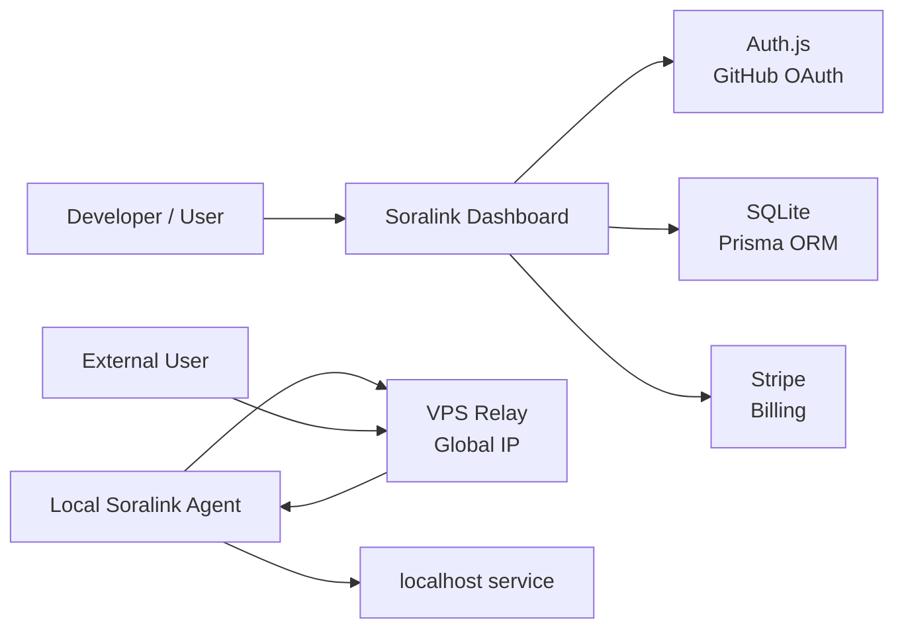

# Soralink ドキュメント

Soralink は、ローカル環境の HTTP/TCP サービスをインターネットへ安全に公開するトンネルサービスです。体験としては ngrok に近く、ユーザーは Web でログインしてトークンを取得し、ローカルの Go 製 CLI/Agent に設定して使います。

Soralink は OSS として開発します。実装、Issue、Pull Request、設定例、デプロイ手順は公開される前提のため、API key、Agent token、GitHub OAuth secret、Auth.js secret、Stripe secret、SQLite DB ファイルなどの秘匿情報をリポジトリに含めない運用を必須とします。

## ドキュメント構成

- [要件定義](docs/requirements.md)
  - サービスの目的、対象ユーザー、機能要件、非機能要件、MVP 範囲。
- [技術仕様](docs/technical-spec.md)
  - Go で実装する前提のアーキテクチャ、トンネルプロトコル、CLI、API、データモデル。
- [技術スタック](docs/tech-stack.md)
  - フロントエンド、Go Relay/Agent、Auth.js、SQLite、Prisma、Stripe、VPS デプロイ、CI/セキュリティツール。
- [フロントエンド画面仕様](docs/frontend-spec.md)
  - Dashboard のページ構成、画面要件、UI コンポーネント、API/状態設計。
- [課金プラン仕様](docs/billing-plans.md)
  - Stripe で扱う Hosted SaaS の Free / Pro / Team / Enterprise プラン、quota、Webhook 同期方針。
- [ロードマップ](docs/roadmap.md)
  - 作る順番、リリース単位、優先度。

## 初期方針

最初から ngrok の全機能を追うのではなく、次の順で作るのが現実的です。

1. TCP トンネルのコアを作る
2. HTTP/HTTPS トンネルとランダムサブドメインを作る
3. Auth.js の GitHub OAuth ログイン、トークン発行、ダッシュボードを作る
4. SQLite + Prisma でユーザー、トークン、利用量を管理する
5. カスタムドメイン、アクセス制御、ログ/メトリクスを足す
6. Stripe でプラン制限と課金へ拡張する

初期インフラは、開発者が所有しているグローバル IP 付き VPS 1 台を Relay として利用します。SaaS として育てる場合でも、最初の実装は「単一 VPS Relay + Auth.js + SQLite + Prisma + Stripe」で始めると、ネットワーク部分を小さく検証できます。

