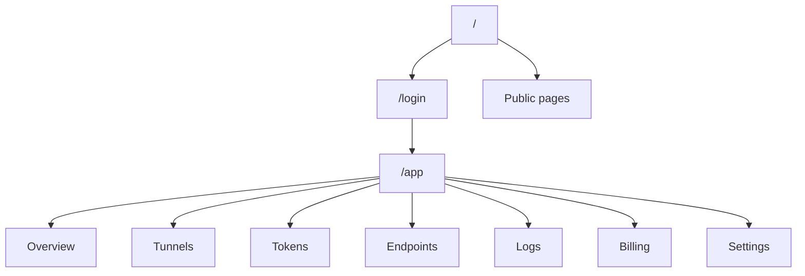

# Soralink フロントエンド画面仕様

## 1. 目的

Soralink Dashboard は、ユーザーが GitHub OAuth でログインし、Agent token を発行し、HTTP/TCP tunnel の状態・利用量・ログ・課金状態を確認するための管理画面である。

初期 MVP では、開発者や個人ユーザーが 1 人で使うことを主対象にする。将来のチーム管理や複数 Relay には拡張できるが、最初の画面は「今つながっている tunnel をすぐ見て、必要な token を発行できる」ことを優先する。

## 2. UX 方針

- `/` は未ログインでも見られる公開ホームページにする。
- ログイン後の first screen は dashboard とし、`/app` に遷移する。
- SaaS 管理画面として、密度高めで静かな UI にする。
- 主要操作は 2 click 以内で到達できるようにする。
- tunnel、token、endpoint、request log はテーブル中心で scan しやすくする。
- 危険操作は dialog で確認し、即時に復旧できない操作は明確に示す。
- secret、token、DB path、internal secret は UI に表示しない。
- Agent token は作成直後だけ一度表示し、再表示不可にする。

## 3. ルーティング

Next.js App Router を前提とする。

| Route | 認証 | 画面 | 優先度 |
| --- | --- | --- | --- |
| `/` | public | ホームページ | P1 |
| `/login` | public | GitHub OAuth ログイン | P1 |
| `/auth/error` | public | OAuth / session error | P1 |
| `/support` | public | サポート / 問い合わせ | P2 |
| `/terms` | public | 利用規約 | P1 |
| `/privacy-policy` | public | プライバシーポリシー | P1 |
| `/law` | public | 特定商取引法に基づく表記 | P1 |
| `/app` | required | Overview dashboard | P1 |
| `/app/tunnels` | required | Active tunnels | P1 |
| `/app/tokens` | required | Agent tokens | P1 |
| `/app/endpoints` | required | Reserved endpoints | P2 |
| `/app/logs` | required | Request / connection logs | P2 |
| `/app/billing` | required | Plan / usage / Stripe portal | P2 |
| `/app/settings` | required | Profile / account settings | P2 |
| `/app/settings/security` | required | Security settings | P3 |
| `/app/team` | required | Team / members | P3 |

未ログインで `/app/*` にアクセスした場合は `/login` に redirect する。`/`, `/login`, `/support`, `/terms`, `/privacy-policy`, `/law` はログイン不要で閲覧できる。

## 4. アプリシェル

### 4.1 Layout

### 4.2 共通 UI

| 領域 | 内容 |
| --- | --- |
| Sidebar | Overview, Tunnels, Tokens, Endpoints, Logs, Billing, Settings |
| Header | page title, region/relay status, user menu |
| Status bar | Relay online/offline, active tunnels, current plan |
| User menu | GitHub profile, settings, sign out |
| Toast | token created, tunnel stopped, billing updated など |

### 4.3 ナビゲーション

- Desktop は左 sidebar 固定。
- Mobile は sheet/drawer navigation。
- 現在ページは nav item の active state で示す。
- 主要 action は各ページ header 右側に置く。
- 公開ページ header には `Sign in` と GitHub repository link を置く。
- 公開ページ footer には `Support`, `Terms`, `Privacy Policy`, `Law` を常設する。

## 5. 画面別仕様

### 5.1 `/`

目的:

- 未ログインユーザーに Soralink の概要、使い方、OSS 方針、ログイン導線を示す。

表示:

| セクション | 内容 |
| --- | --- |
| First view | Soralink 名、短い価値説明、GitHub login / docs 導線 |
| How it works | VPS Relay、Agent、localhost の簡単な図 |
| Use cases | Webhook、demo、mobile test、TCP tunnel |
| Quick start | `soralink auth`, `soralink http 3000`, `soralink tcp 22` の例 |
| OSS | GitHub repository、self-hostable 方針 |
| Footer | Support, Terms, Privacy Policy, Law |

操作:

- `Sign in with GitHub` -> `/login` または Auth.js `signIn("github")`。
- `View docs` -> GitHub repository または docs page。

注意:

- 過度な marketing landing page にはしない。
- first view は Soralink の実体と使い方がすぐ分かる構成にする。
- ログイン済みなら primary action は `/app` にする。

### 5.2 `/login`

目的:

- GitHub OAuth でログインする。

表示:

- Soralink ロゴ / サービス名。
- `Continue with GitHub` button。
- OSS / self-hostable であることの短い補足。
- OAuth error がある場合の error alert。

操作:

- `Continue with GitHub` -> Auth.js `signIn("github")`。
- ログイン済みなら `/app` へ redirect。

セキュリティ:

- GitHub OAuth secret は server env のみに置く。
- callback URL は GitHub OAuth App と一致させる。

### 5.3 `/support`

目的:

- ユーザーが問い合わせ先、障害報告先、OSS issue 導線を確認できるようにする。

表示:

| セクション | 内容 |
| --- | --- |
| Contact | support email または問い合わせ form への導線 |
| GitHub | Issues / Discussions / Security policy への link |
| Status | Relay / Dashboard の稼働状況 link。MVP は placeholder でよい |
| FAQ | token、tunnel、billing、security の基本回答 |

MVP:

- 問い合わせ form は作らず、support email と GitHub Issues への link でよい。
- security issue は通常 issue ではなく `SECURITY.md` を案内する。

### 5.4 `/terms`

目的:

- Soralink の利用条件、禁止事項、免責、アカウント停止条件を明示する。

表示:

- サービス概要。
- アカウントと Agent token の管理責任。
- 禁止行為。
- 公開 tunnel の利用責任。
- abuse / spam / malware / phishing への対応。
- 料金とプラン変更。
- サービス停止、仕様変更、免責。
- OSS license との関係。
- 最終更新日。

注意:

- 初期文面は placeholder でよいが、本番公開前に法務レビューする。

### 5.5 `/privacy-policy`

目的:

- 取得する情報、利用目的、第三者サービス、保存期間、問い合わせ先を明示する。

表示:

| 項目 | 内容 |
| --- | --- |
| Account data | GitHub profile、email、avatar |
| Operational data | tunnel metadata、connection logs、usage |
| Billing data | Stripe customer id、subscription status |
| Cookies | Auth.js session cookie |
| Logs | IP address、User-Agent、request metadata |
| Third parties | GitHub, Stripe, hosting provider |
| Retention | logs / account / billing metadata の保存期間 |

セキュリティ:

- `Authorization`, `Cookie`, `Set-Cookie` などの機密 header は mask する方針を明記する。
- request/response body inspection は opt-in であることを明記する。

### 5.6 `/law`

目的:

- 日本向けに、特定商取引法に基づく表記を掲載する。

表示:

| 項目 | 内容 |
| --- | --- |
| 販売事業者 | 個人/法人名。本番前に確定 |
| 運営責任者 | 本番前に確定 |
| 所在地 | 本番前に確定。公開範囲は法務確認 |
| 連絡先 | support email |
| 販売価格 | plan page または billing 表示への参照 |
| 追加料金 | 通信料、税、外部決済手数料など |
| 支払い方法 | Stripe が提供する決済手段 |
| 支払い時期 | subscription / checkout に従う |
| 提供時期 | 決済後または登録後すぐ |
| キャンセル | Customer Portal または問い合わせ |
| 返金 | 原則や条件を明記 |

注意:

- `law` は本番公開前に必ず最新の事業形態に合わせて更新する。
- 個人情報の公開範囲は慎重に扱い、必要に応じて専門家に確認する。

### 5.7 `/app` Overview

目的:

- 現在の Soralink の状態を 1 画面で把握する。

表示:

| セクション | 内容 |
| --- | --- |
| Status summary | Relay status, active tunnels, active connections |
| Quick start | `soralink auth <TOKEN>` 未発行時の導線 |
| Forwarding | active tunnel の公開 URL / local addr |
| Usage | 今月の転送量、接続数、plan limit |
| Recent activity | 直近 connection / request log |

主要 action:

- `Create token`
- `Open tunnels`
- `View logs`
- `Open billing`

Empty state:

- token がない場合: token 作成を促す。
- tunnel がない場合: `soralink http 3000` の最小 command を表示する。

### 5.8 `/app/tunnels`

目的:

- active tunnel を確認し、必要に応じて停止する。

表示カラム:

| カラム | 内容 |
| --- | --- |
| Protocol | http / tcp |
| Public endpoint | URL or host:port |
| Local addr | `localhost:3000` など |
| Status | online / reconnecting / offline |
| Connections | active connection count |
| Bytes | in/out total |
| Created | 作成日時 |
| Actions | copy, open, stop |

操作:

- public endpoint を copy。
- HTTP endpoint を new tab で open。
- tunnel を stop。
- row click で detail drawer を開く。

Detail drawer:

- tunnel id。
- Agent / token 名。
- 接続元 remote addr の直近一覧。
- bytes in/out。
- related logs への link。

### 5.9 `/app/tokens`

目的:

- Agent token を発行・失効・確認する。

表示カラム:

| カラム | 内容 |
| --- | --- |
| Name | token 表示名 |
| Prefix | token prefix |
| Last used | 最終利用日時 |
| Created | 作成日時 |
| Status | active / revoked |
| Actions | rename, revoke |

作成 dialog:

- name input。
- optional expires at は P2。
- create 後、token full value を一度だけ表示。
- copy button。
- dialog を閉じると token full value は再表示不可。

セキュリティ:

- `secretHash` は API response に含めない。
- revoke は soft delete ではなく `revokedAt` を設定する。
- token full value は browser storage に保存しない。

### 5.10 `/app/endpoints`

目的:

- 予約 subdomain / 固定 TCP port / access control を管理する。

MVP:

- 読み取り中心。
- 予約 endpoint は P2 以降。

表示カラム:

| カラム | 内容 |
| --- | --- |
| Type | http / tcp |
| Endpoint | subdomain or tcp port |
| Reserved | yes/no |
| Linked tunnel | active tunnel があれば表示 |
| Access | public / allowlist / basic auth |
| Actions | edit, release |

作成 dialog:

- protocol select。
- subdomain input または tcp port request。
- access control 初期値。

### 5.11 `/app/logs`

目的:

- HTTP request / TCP connection を確認してデバッグできるようにする。

Tabs:

- HTTP Requests
- TCP Connections

HTTP log カラム:

| カラム | 内容 |
| --- | --- |
| Time | 開始日時 |
| Method | GET / POST など |
| Path | request path |
| Status | HTTP status |
| Duration | latency |
| Size | bytes in/out |
| Tunnel | tunnel |

TCP log カラム:

| カラム | 内容 |
| --- | --- |
| Time | 開始日時 |
| Remote addr | 接続元 |
| Tunnel | tunnel |
| Duration | 接続時間 |
| Bytes | in/out |
| Result | completed / error |

Filters:

- tunnel。
- status。
- method。
- time range。
- search path。

Inspection:

- request/response body 保存はデフォルト OFF。
- `Authorization`, `Cookie`, `Set-Cookie` は必ず mask。
- body preview は保存上限を持つ。

### 5.12 `/app/billing`

目的:

- plan、usage、請求導線を管理する。

表示:

| セクション | 内容 |
| --- | --- |
| Current plan | Free / Pro / Team |
| Usage | tunnels, connections, transfer |
| Limits | plan ごとの上限 |
| Plan comparison | Free / Pro / Team / Enterprise の価格と主要機能 |
| Billing actions | Checkout / Customer Portal |
| Stripe status | subscription status |

操作:

- upgrade -> Stripe Checkout。
- manage billing -> Stripe Customer Portal。
- cancel は Customer Portal 側へ誘導する。

初期表示する plan:

| Plan | 価格 | 表示する主な差分 |
| --- | ---: | --- |
| Free | 0円 | 1 active tunnel、5GB/月、TCP は invite / disabled |
| Pro | 1,200円/月 | 5 active tunnel、100GB/月、TCP、予約 subdomain、固定 TCP port |
| Team | 4,800円/月 | 5 seats、20 active tunnel、1TB/月、team 管理、custom domain |
| Enterprise | 個別見積 | dedicated Relay、SLA、個別 quota |

Free はカード登録不要。Pro / Team は Checkout へ遷移する。Enterprise は `/support` または問い合わせ導線へ送る。

### 5.13 `/app/settings`

目的:

- profile とアプリ設定を管理する。

表示:

- GitHub account。
- display name。
- avatar。
- default region。
- default tunnel config。
- danger zone。

操作:

- profile update。
- sign out。
- account deletion は P3。

### 5.14 `/app/settings/security`

目的:

- セキュリティ関連設定を集約する。

表示:

- active sessions。
- recent login。
- token count。
- internal warnings。

MVP:

- read-only でよい。

P3:

- session revoke。
- token IP allowlist default。
- audit log export。

## 6. API / データ要件

Dashboard API は Route Handlers を基本とし、すべて server-side で Auth.js session を検証する。

| API | 用途 | 認証 |
| --- | --- | --- |
| `GET /api/me` | current user / plan | Auth.js session |
| `GET /api/tunnels` | active tunnel 一覧 | Auth.js session |
| `DELETE /api/tunnels/:id` | tunnel 停止 | Auth.js session |
| `GET /api/tokens` | token 一覧 | Auth.js session |
| `POST /api/tokens` | token 作成 | Auth.js session |
| `PATCH /api/tokens/:id` | token rename / revoke | Auth.js session |
| `GET /api/endpoints` | endpoint 一覧 | Auth.js session |
| `POST /api/endpoints` | endpoint 予約 | Auth.js session |
| `GET /api/logs` | logs 一覧 | Auth.js session |
| `GET /api/billing/plans` | plan 一覧と quota | Auth.js session |
| `GET /api/billing/usage` | 現在 period の usage | Auth.js session |
| `POST /api/billing/checkout` | Stripe Checkout 作成 | Auth.js session |
| `POST /api/billing/portal` | Stripe Portal 作成 | Auth.js session |
| `POST /api/stripe/webhook` | Stripe Webhook | Stripe signature |
| `POST /api/internal/agent-token/verify` | Relay token 検証 | internal secret |

公開ページは原則 static content とする。`/support` に問い合わせ form を追加する場合は、rate limit、CSRF/session の扱い、spam 対策を別途定義する。

Prisma query 方針:

- user-owned data は必ず `where: { userId: session.user.id }` を含める。
- `secretHash` は select しない、または DTO で除外する。
- `BigInt` は JSON response で string へ変換する。
- pagination は `cursor` または `createdAt` based を基本にする。

## 7. 状態設計

各画面は次の state を持つ。

| State | 表示 |
| --- | --- |
| Loading | skeleton table / skeleton card |
| Empty | 次 action が明確な empty state |
| Error | retry button 付き alert |
| Unauthorized | `/login` redirect |
| Forbidden | 権限不足 message |
| Success | toast + optimistic update |

リアルタイム更新:

- MVP は polling でよい。
- active tunnels は 5-10 秒間隔。
- logs は手動 refresh + optional polling。
- 将来は SSE / WebSocket で event stream にする。

## 8. UI コンポーネント

優先して用意する component:

| Component | 用途 |
| --- | --- |
| `AppShell` | sidebar/header layout |
| `StatusBadge` | online/offline/revoked/status |
| `CopyButton` | token / endpoint copy |
| `MetricCard` | usage / active count |
| `DataTable` | tunnels/tokens/logs |
| `CreateTokenDialog` | token 作成 |
| `ConfirmDialog` | revoke / stop / release |
| `EndpointCell` | URL / host:port 表示 |
| `UsageMeter` | plan limit 表示 |
| `DateTimeCell` | relative + absolute time |

UI ライブラリ:

- shadcn/ui: table, dialog, dropdown-menu, tabs, sheet, toast, badge, input, select。
- lucide-react: copy, external-link, key, activity, terminal, plug, shield, credit-card, settings。

## 9. セキュリティ要件

- `AUTH_SECRET`, `AUTH_GITHUB_SECRET`, `DATABASE_URL`, `STRIPE_SECRET_KEY` は server env のみに置く。
- Prisma Client は server-only module から import する。
- token full value は作成直後のみ表示し、DB には hash だけ保存する。
- `secretHash`, Stripe secret, internal secret は API response に含めない。
- destructive action は CSRF/session 前提に加え、confirm dialog を出す。
- Webhook は raw body と `Stripe-Signature` で検証する。
- logs では `Authorization`, `Cookie`, `Set-Cookie` を mask する。

## 10. MVP 範囲

MVP で作る画面:

- `/`
- `/login`
- `/support`
- `/terms`
- `/privacy-policy`
- `/law`
- `/app`
- `/app/tunnels`
- `/app/tokens`
- `/app/logs` の簡易版
- `/app/billing` の placeholder + Stripe portal/checkout 導線
- `/app/settings` の profile 表示

MVP では作らない:

- team 管理。
- account deletion。
- full request/response body inspector。
- custom domain wizard。
- rich realtime event stream。
- role-based access control。

## 11. 受け入れ基準

- 未ログインで `/` にアクセスするとホームページが表示される。
- 未ログインで `/terms`, `/privacy-policy`, `/law` にアクセスできる。
- 未ログインで `/app/*` にアクセスすると `/login` に redirect する。
- GitHub OAuth でログインすると `/app` に遷移する。
- `/app/tokens` で Agent token を作成でき、full token は一度だけ表示される。
- `/app/tunnels` で active tunnel と public endpoint を確認できる。
- 別ユーザーの token / tunnel / log は API 経由で取得できない。
- `secretHash` と `DATABASE_URL` は browser response / bundle に含まれない。
- Stripe Checkout / Customer Portal への導線が用意されている。
- `/support` から support email、GitHub Issues、security policy に到達できる。
