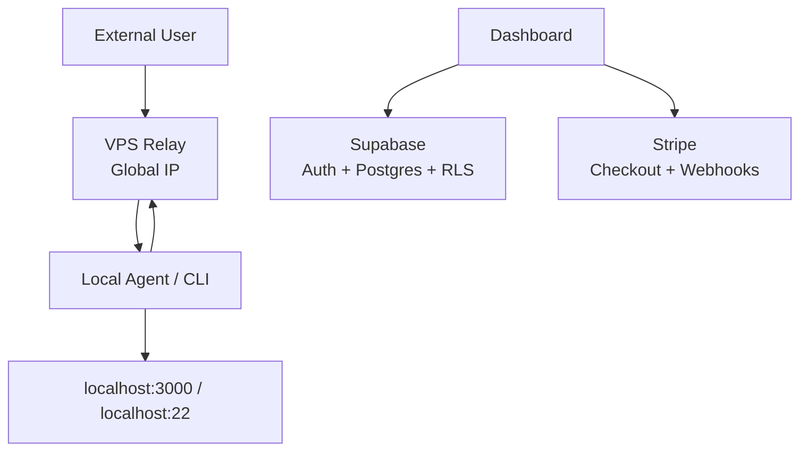

# Soralink 要件定義

## 1. 概要

Soralink は、NAT やルーターのポート開放をせずに、ローカルマシン上の開発サーバーや TCP サービスを外部公開できるトンネルサービスである。

Soralink は OSS として開発する。ソースコード、Issue、Pull Request、デプロイ例が公開される前提で、秘匿情報をリポジトリに含めない設計と運用を必須とする。

ユーザー体験は次を基本形とする。

```bash
# Web ダッシュボードで取得したトークンを保存
soralink auth <TOKEN>

# HTTP 開発サーバーを公開
soralink http 3000

# SSH や DB など TCP サービスを公開
soralink tcp 22
```

公開例:

```text
https://blue-sky-123.soralink.dev -> http://localhost:3000
tcp://jp-1.soralink.dev:21432     -> localhost:22
```

## 2. 目的

- ローカル開発環境を一時的に外部公開できるようにする。
- Webhook の受信確認、スマホ実機確認、外部レビュー、デモ用途を簡単にする。
- TCP サービスも公開できるようにし、SSH、DB、ゲームサーバーなどへ拡張可能にする。
- 将来的には SaaS とセルフホストの両方に対応できる設計にする。
- OSS として安全に開発できるよう、キー管理、RLS、ログマスク、権限分離を初期仕様に含める。

## 3. 対象ユーザー

| ユーザー | 主な用途 | 重要な価値 |
| --- | --- | --- |
| Web 開発者 | Webhook、OAuth callback、スマホ実機確認 | すぐ公開できる、HTTPS が使える |
| 個人開発者 | デモ共有、検証環境公開 | URL を共有しやすい、無料/低コスト |
| インフラ/バックエンド開発者 | SSH、DB、内部ツールの一時公開 | TCP 対応、アクセス制御 |
| ゲームサーバー運営者 | 自宅サーバー公開 | TCP/UDP 対応、ポート開放不要 |
| チーム/企業 | レビュー環境、社内検証 | 監査ログ、チーム管理、権限制御 |

## 4. 用語

| 用語 | 意味 |
| --- | --- |
| Agent | ユーザーのローカルマシンで動く `soralink` CLI/常駐プロセス |
| Relay / Edge | グローバル IP を持ち、外部通信を受ける Soralink サーバー |
| Control Plane | Web ダッシュボード、認証、トークン、課金、設定管理を担う API |
| Tunnel | 公開 endpoint とローカルサービスの対応関係 |
| Endpoint | 外部からアクセスする URL、ドメイン、TCP アドレス |
| Session | Agent と Relay の間に張られた認証済み接続 |
| Connection | 外部ユーザーから来た 1 本の HTTP/TCP 接続 |

## 5. 提供形態

### 5.1 Hosted SaaS

Soralink 側が Relay / Control Plane / Dashboard を運用する。ユーザーはアカウント登録後、Agent をインストールして使う。

### 5.2 Self-hosted

ユーザーが自分の VPS に Relay を立てる。初期開発ではこの構成を優先すると、課金やマルチテナントなしで中核機能を検証できる。

### 5.3 初期インフラ前提

開発者はグローバル IP を持つ VPS を 1 台所有しているため、初期の Relay / Edge はその VPS 上に構築する。



この構成では、Relay はトンネル転送を担当し、ユーザー認証、アカウント情報、トークン管理、課金情報は Supabase と Stripe を利用する。

## 6. 機能要件

### 6.1 アカウント・認証

| ID | 要件 | 優先度 |
| --- | --- | --- |
| AUTH-001 | ログイン機能は Supabase Auth を使用する | P1 |
| AUTH-002 | OAuth provider は GitHub のみ対応する | P1 |
| AUTH-003 | メールアドレス + パスワードの独自認証は実装しない | P1 |
| AUTH-004 | Dashboard は Supabase session を使ってログイン状態を管理する | P1 |
| AUTH-005 | Backend / Relay は Supabase JWT を検証してユーザーを識別する | P1 |
| AUTH-006 | ユーザーは Agent 用トークンを発行できる | P1 |
| AUTH-007 | Agent トークンは作成時のみ平文表示し、DB にはハッシュで保存する | P1 |
| AUTH-008 | Agent トークンは失効、再発行、名前付けができる | P2 |
| AUTH-009 | Agent トークンごとに接続元 IP 制限を設定できる | P3 |

### 6.2 Supabase / RLS

| ID | 要件 | 優先度 |
| --- | --- | --- |
| DB-001 | DB は Supabase Postgres を使用する | P1 |
| DB-002 | ユーザー管理は Supabase の `auth.users` を信頼する | P1 |
| DB-003 | アプリ用テーブルは原則 RLS を有効化する | P1 |
| DB-004 | `user_id = auth.uid()` を基本に、ユーザーは自分の行だけ読める/更新できる | P1 |
| DB-005 | `agent_tokens.secret_hash` などの秘匿値は RLS だけに依存せず、private schema / view / RPC / backend API により client から直接読めない | P1 |
| DB-006 | Relay / backend の管理処理だけが Supabase secret/service role key を使用できる | P1 |
| DB-007 | secret/service role key は browser、mobile、CLI、GitHub Actions の public log に露出させない | P1 |
| DB-008 | RLS policy は SQL migration としてレビュー可能にする | P1 |

### 6.3 CLI / Agent

| ID | 要件 | 優先度 |
| --- | --- | --- |
| CLI-001 | Go 製のクロスプラットフォーム CLI として配布する | P1 |
| CLI-002 | `soralink auth <TOKEN>` でローカル設定にトークンを保存できる | P1 |
| CLI-003 | `soralink http <PORT>` で HTTP トンネルを開始できる | P1 |
| CLI-004 | `soralink tcp <PORT>` で TCP トンネルを開始できる | P1 |
| CLI-005 | トンネル開始後、公開 URL/アドレスをターミナルに表示する | P1 |
| CLI-006 | 切断時に自動再接続し、トンネルを復旧する | P1 |
| CLI-007 | YAML 設定ファイルから複数トンネルを同時起動できる | P2 |
| CLI-008 | HTTP リクエスト履歴をターミナルで確認できる | P2 |
| CLI-009 | `soralink update` で自己更新できる | P3 |

### 6.4 HTTP / HTTPS トンネル

| ID | 要件 | 優先度 |
| --- | --- | --- |
| HTTP-001 | ローカル HTTP サーバーを公開 URL に転送できる | P1 |
| HTTP-002 | ランダムサブドメインを自動割り当てできる | P1 |
| HTTP-003 | HTTPS 終端を Relay 側で行える | P1 |
| HTTP-004 | WebSocket を中継できる | P1 |
| HTTP-005 | HTTP/2 クライアントからのアクセスに対応できる | P2 |
| HTTP-006 | 予約済みサブドメインを使える | P2 |
| HTTP-007 | カスタムドメインを CNAME で接続できる | P2 |
| HTTP-008 | Basic Auth / Bearer token / IP allowlist を endpoint に設定できる | P2 |
| HTTP-009 | HTTP リクエスト/レスポンスの inspection を任意で有効化できる | P2 |
| HTTP-010 | リクエストヘッダーの追加/削除/書き換えを設定できる | P3 |

### 6.5 TCP トンネル

| ID | 要件 | 優先度 |
| --- | --- | --- |
| TCP-001 | ローカル TCP ポートを Relay の公開 TCP アドレスへ転送できる | P1 |
| TCP-002 | Relay は利用可能な公開ポートを自動割り当てできる | P1 |
| TCP-003 | ユーザーは固定 TCP アドレスを予約できる | P2 |
| TCP-004 | TCP endpoint に IP allowlist を設定できる | P2 |
| TCP-005 | SSH、DB、任意の TCP サービスで動作する | P2 |
| TCP-006 | 同時接続数、転送量、接続時間を記録できる | P2 |

### 6.6 UDP トンネル

UDP は優先度低めとし、初期 MVP からは外す。ゲームサーバー用途を狙う場合の拡張機能とする。

| ID | 要件 | 優先度 |
| --- | --- | --- |
| UDP-001 | UDP パケットを Relay 経由でローカル UDP サービスへ転送できる | P3 |
| UDP-002 | Minecraft Bedrock、Valheim などのプリセットを提供できる | P3 |
| UDP-003 | NAT セッション管理とタイムアウト GC を実装する | P3 |

### 6.7 Web ダッシュボード

| ID | 要件 | 優先度 |
| --- | --- | --- |
| WEB-001 | ユーザーは現在の active tunnel を一覧できる | P1 |
| WEB-002 | Agent トークンを発行、失効、名前変更できる | P1 |
| WEB-003 | endpoint のアクセスログと転送量を確認できる | P2 |
| WEB-004 | サブドメイン予約、カスタムドメイン設定ができる | P2 |
| WEB-005 | トンネルを Web から強制停止できる | P2 |
| WEB-006 | チームメンバー、権限、監査ログを管理できる | P3 |
| WEB-007 | プラン、請求、利用量を確認できる | P3 |

### 6.8 管理 API

| ID | 要件 | 優先度 |
| --- | --- | --- |
| API-001 | REST API でトークン、endpoint、tunnel を管理できる | P2 |
| API-002 | Agent はトークンを使って Relay に認証できる | P1 |
| API-003 | 管理 API は Bearer token / session cookie で認証する | P1 |
| API-004 | API は OpenAPI 形式で仕様を出力できる | P3 |

### 6.9 可観測性

| ID | 要件 | 優先度 |
| --- | --- | --- |
| OBS-001 | 構造化ログを出力する | P1 |
| OBS-002 | active tunnel、接続数、転送量をメトリクス化する | P2 |
| OBS-003 | Prometheus `/metrics` を提供する | P2 |
| OBS-004 | HTTP request inspection はデフォルト OFF にする | P1 |
| OBS-005 | Cookie、Authorization などの機密ヘッダーはログでマスクする | P1 |

### 6.10 課金

| ID | 要件 | 優先度 |
| --- | --- | --- |
| BILL-001 | 課金は Stripe を使用する | P2 |
| BILL-002 | Checkout で有料プランへ加入できる | P2 |
| BILL-003 | Customer Portal で支払い方法、請求履歴、解約を管理できる | P2 |
| BILL-004 | Stripe Webhook を受け取り、subscription 状態を Supabase に同期する | P2 |
| BILL-005 | Webhook は Stripe signature を検証してから処理する | P1 |
| BILL-006 | プランに応じて tunnel 数、固定 subdomain、固定 TCP port、転送量を制限できる | P2 |

### 6.11 OSS 開発

| ID | 要件 | 優先度 |
| --- | --- | --- |
| OSS-001 | Soralink は OSS として公開開発する | P1 |
| OSS-002 | README に開発方針、ライセンス、セキュリティポリシーを記載する | P1 |
| OSS-003 | secret を含む `.env`、証明書秘密鍵、Supabase secret key、Stripe secret key は commit 禁止とする | P1 |
| OSS-004 | `.env.example` にはダミー値のみ置く | P1 |
| OSS-005 | 脆弱性報告窓口として `SECURITY.md` を用意する | P2 |
| OSS-006 | PR では RLS policy、認可、ログ出力、secret 露出を重点レビューする | P1 |

## 7. 非機能要件

### 7.1 セキュリティ

- Agent と Relay の通信は TLS で暗号化する。
- Agent トークンは DB に平文保存しない。
- トークンは prefix + secret 形式にし、検索用 prefix と検証用 hash を分ける。
- Supabase のアプリ用テーブルは RLS を有効化し、ユーザー境界を DB 側でも強制する。
- Supabase publishable key は公開 client に置けるが、secret key / service role key は backend / Relay の環境変数に限定する。
- Supabase secret key / service role key は RLS を迂回できるため、browser、CLI、公開リポジトリ、ログ、URL query に絶対に出さない。
- Stripe secret key と webhook signing secret は backend の環境変数に限定する。
- Stripe Webhook は署名検証に成功した event のみ処理する。
- endpoint には rate limit、同時接続数制限、IP allowlist を設定できる。
- HTTP inspection は opt-in とし、機密ヘッダー/ボディをマスクできる。
- abuse 対策として、無料プランの公開 URL にはレート制限と警告/ブロック機構を用意する。
- OSS 開発では secret scanning、依存関係スキャン、最小権限の CI secret を使う。

### 7.2 信頼性

- Agent はネットワーク切断時に exponential backoff + jitter で再接続する。
- Relay は Agent 切断時に関連 tunnel を必ず解放する。
- 半開き接続検出のため ping/pong heartbeat を持つ。
- graceful shutdown により新規接続受付停止、既存接続終了待ち、リソース解放を行う。

### 7.3 性能

- MVP では 1 Relay あたり 1,000 active tunnel、10,000 concurrent connection を目標値にする。
- HTTP/TCP 中継の追加レイテンシは同一リージョンで p95 50ms 未満を目標にする。
- 大容量転送時にメモリへ全 body を載せない。基本は stream copy とする。
- inspection 有効時も保存する body は上限を持つ。

### 7.4 運用

- Relay は開発者所有のグローバル IP 付き VPS 上で Linux systemd / Docker により起動できる。
- 設定は YAML と環境変数で管理できる。
- ログは JSON 出力に対応する。
- ヘルスチェック endpoint を提供する。
- 証明書更新、DB migration、バックアップ手順を運用ドキュメント化する。
- Supabase migration と RLS policy は repository で管理し、Supabase Dashboard の手作業変更だけに依存しない。

### 7.5 配布

- CLI は Windows、macOS、Linux に対応する。
- Go の single binary として配布する。
- Homebrew、Scoop、GitHub Releases による配布を想定する。

## 8. MVP 範囲

最初の MVP は「Soralink Core」として、次だけを作る。

### 必須

- Go 製 `soralink` CLI
- Go 製 Relay server
- 開発者所有のグローバル IP 付き VPS 1 台で動く Relay
- Supabase Auth による GitHub OAuth ログイン
- Supabase Postgres による token / tunnel metadata 管理
- Supabase RLS policy によるユーザーごとのデータ分離
- Agent token による認証
- TCP トンネル
- HTTP トンネル
- ランダムサブドメイン
- HTTPS 終端
- Agent 自動再接続
- basic な構造化ログ
- 単一ユーザー/単一テナント構成

### MVP ではやらない

- Stripe 課金の本番運用
- チーム管理
- UDP
- カスタムドメイン
- リッチな Web ダッシュボード
- request/response body の完全保存
- 複数リージョン

## 9. 受け入れ基準

MVP 完了の条件:

- `soralink auth <TOKEN>` で token が保存される。
- `soralink http 3000` を実行すると `https://<random>.soralink.dev` が表示される。
- 外部ブラウザからその URL にアクセスすると `localhost:3000` に到達する。
- WebSocket echo サーバーがトンネル越しに動く。
- `soralink tcp 22` を実行すると公開 TCP アドレスが表示される。
- 外部からその TCP アドレスへ接続すると `localhost:22` に到達する。
- Agent を停止すると endpoint は閉じられる。
- Relay を再起動すると Agent が自動再接続する。
- 不正 token では接続できない。
- GitHub OAuth で Dashboard にログインできる。
- Supabase RLS により別ユーザーの token / tunnel metadata を取得できない。
- Relay ログに tunnel 作成、接続開始、接続終了、転送量が出る。

## 10. 参考にした公開情報

2026-05-16 時点で、ngrok の公開ドキュメントでは agent の authtoken 認証、HTTP/S endpoint、TCP endpoint、ランダム URL、固定 TCP address、独自ドメイン、Traffic Policy などが説明されている。Soralink はこれらを参考にしつつ、初期実装では HTTP/TCP トンネルに絞る。

- ngrok Agent: https://ngrok.com/docs/agent
- ngrok Agent CLI: https://ngrok.com/docs/agent/cli
- ngrok HTTP/S Endpoints: https://ngrok.com/docs/universal-gateway/http
- ngrok TCP Endpoints: https://ngrok.com/docs/universal-gateway/tcp
- Supabase Auth: https://supabase.com/docs/guides/auth
- Supabase GitHub OAuth: https://supabase.com/docs/guides/auth/social-login/auth-github
- Supabase Row Level Security: https://supabase.com/docs/guides/database/postgres/row-level-security
- Supabase API Keys: https://supabase.com/docs/guides/api/api-keys
- Stripe Subscriptions: https://docs.stripe.com/payments/subscriptions
- Stripe Webhook Signatures: https://docs.stripe.com/webhooks/signatures
