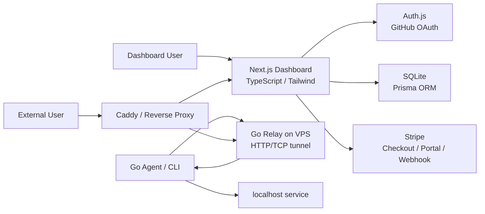
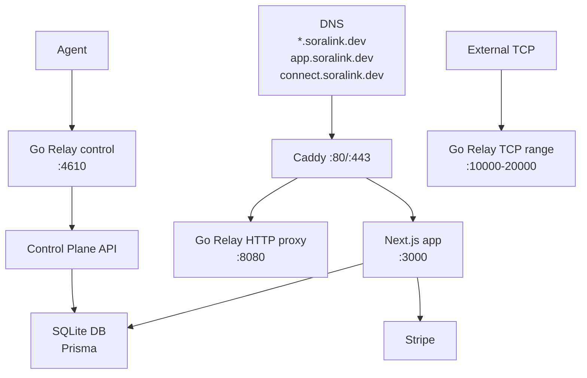

# Soralink 技術スタック

## 1. 選定方針

Soralink は OSS として開発し、Hosted SaaS とセルフホストの両方へ拡張できる構成にする。初期実装では、開発者所有のグローバル IP 付き VPS 1 台を Relay として使い、認証・DB・課金は自前の Dashboard API、Auth.js、SQLite、Prisma、Stripe で構成する。

選定基準:

- ネットワーク中継は Go で堅牢に実装する。
- Dashboard は Auth.js / Prisma / Stripe と相性がよい Next.js を使う。
- DB は初期 VPS 1 台で運用しやすい SQLite を使い、Prisma で型安全に扱う。
- 認可は Auth.js session と API/Prisma query の `userId` 条件で強制する。
- OSS 前提で secret と SQLite DB ファイルを露出しにくい構成にする。
- 将来、複数インスタンスや高トラフィックが必要になったら PostgreSQL へ移行できる余地を残す。



## 2. 採用スタック一覧

| 領域 | 採用 | 用途 |
| --- | --- | --- |
| Relay / Agent | Go | トンネル、TCP/HTTP bridge、CLI |
| CLI framework | Cobra | `soralink http`, `soralink tcp`, `soralink auth` などのサブコマンド |
| 設定ファイル | YAML | `~/.soralink/config.yaml`, `soralink.yml` |
| Dashboard | Next.js App Router | ログイン後の管理画面、BFF/API Route |
| Frontend language | TypeScript | UI と API client の型安全性 |
| UI | React + Tailwind CSS + shadcn/ui | Dashboard UI |
| Icons | lucide-react | ボタン、ナビゲーション、状態表示 |
| Form validation | React Hook Form + Zod | token 作成、endpoint 設定、billing 操作 |
| Auth | Auth.js | GitHub OAuth のみ |
| Auth adapter | `@auth/prisma-adapter` | Auth.js の user/account/session を Prisma で永続化 |
| DB | SQLite | ユーザー、token、endpoint、usage、billing metadata |
| ORM | Prisma | schema、migration、型安全な DB access |
| Authorization | Application-level checks | `auth()` session と `userId` scoped query で保護 |
| Billing | Stripe | Checkout、Customer Portal、Webhook |
| Reverse proxy | Caddy | `app`, `api`, wildcard tunnel host の振り分け |
| Deployment | Docker Compose on VPS | Relay、Dashboard、Caddy を単一 VPS で運用 |
| Logs | Go `slog` + JSON logs | Relay / Agent / API の構造化ログ |
| Metrics | Prometheus client | active tunnel、connection、bytes |
| CI | GitHub Actions | test、lint、build、secret scan |
| Release | GoReleaser | CLI / Relay binary の配布 |

## 3. フロントエンド

画面構成とページごとの詳細要件は [フロントエンド画面仕様](./frontend-spec.md) を正とする。

### 3.1 Dashboard

採用:

- Next.js App Router
- React
- TypeScript
- Tailwind CSS
- shadcn/ui
- lucide-react

理由:

- Auth.js の Next.js integration と相性がよい。
- Prisma と Route Handlers / Server Actions を同じ app 内で扱いやすい。
- Stripe Checkout / Customer Portal への導線を作りやすい。
- App Router の Server Components / Route Handlers で、公開 UI と secret を扱う server 処理を分離しやすい。
- shadcn/ui はコンポーネントのソースをリポジトリ側で所有できるため、OSS でも調整しやすい。

主要画面:

| 画面 | 内容 |
| --- | --- |
| Login | GitHub OAuth ログイン |
| Dashboard | active tunnel、usage、plan status |
| Tokens | Agent token 作成、名前変更、失効 |
| Endpoints | subdomain、TCP port、access control |
| Billing | 現在プラン、Checkout、Customer Portal |
| Logs | HTTP request log、connection log |
| Settings | profile、danger zone |

### 3.2 データ取得方針

- ログイン状態は Auth.js の `auth()` で server 側から取得する。
- Dashboard の通常データは Server Components または Route Handlers 経由で取得する。
- Prisma Client と secret key を client component へ置かない。
- interactive な UI だけ client component にする。
- グローバル状態管理ライブラリは MVP では入れない。必要になったら Zustand を検討する。

### 3.3 UI 方針

- SaaS 管理画面として、密度高めで静かな UI にする。
- 未ログインでは `/` の公開ホームを表示し、ログイン後は dashboard を first screen にする。
- テーブル、タブ、セグメント、トグル、メニュー、ダイアログを中心に構成する。
- アイコンは lucide-react を優先する。
- request log や tunnel 一覧は scan しやすい表示にする。

## 4. Go Relay / Agent

### 4.1 Go を使う範囲

| コンポーネント | 役割 |
| --- | --- |
| `soralink` CLI | `auth`, `http`, `tcp`, `start`, `status` |
| Agent | Relay へ接続し、ローカル service へ bridge |
| Relay | HTTP/TCP endpoint を受け、Agent へ転送 |
| Protocol package | frame、message、heartbeat、error |
| Metrics package | Prometheus metrics |

### 4.2 Go の主要ライブラリ

| 用途 | 採用候補 | 方針 |
| --- | --- | --- |
| CLI | `spf13/cobra` | サブコマンドが多くなるため採用 |
| Config | `gopkg.in/yaml.v3` | YAML を明示的に parse。Viper は MVP では使わない |
| Logging | standard `log/slog` | JSON log に対応 |
| HTTP/TCP | standard `net`, `net/http` | 中核は標準ライブラリ |
| TLS | standard `crypto/tls` | Agent/Relay 通信の暗号化 |
| Metrics | `prometheus/client_golang` | Phase 6 以降 |
| Multiplex | custom frame first, yamux later | MVP は独自 frame、production で再検討 |

### 4.3 Relay の責務

- Agent token を検証する。
- HTTP Host / TCP port から tunnel を解決する。
- 外部接続と Agent stream を bridge する。
- 接続ログ、転送量、active connection を記録する。
- Control Plane API と連携して user、plan、quota を取得する。

### 4.4 Agent の責務

- `soralink auth <TOKEN>` で token を保存する。
- `soralink http 3000` / `soralink tcp 22` で tunnel を作成する。
- Relay 切断時に reconnect する。
- ローカルサービスへ接続し、Relay との間で双方向 bridge する。
- token や config をログに出さない。

## 5. Auth.js / Prisma / SQLite

### 5.1 使用機能

| 機能 | 用途 |
| --- | --- |
| Auth.js | GitHub OAuth、session 管理、protected route |
| GitHub Provider | GitHub OAuth login |
| Prisma Adapter | Auth.js の User / Account / Session 永続化 |
| SQLite | 単一 VPS 上のアプリ DB |
| Prisma Client | 型安全な DB access |
| Prisma Migrate | schema migration |

### 5.2 認可方針

- Dashboard API は必ず `auth()` で session を取得する。
- user-scoped data は Prisma query の `where: { userId: session.user.id }` を基本条件にする。
- Relay/backend が書き込む operational data は内部 secret で保護した API 経由に限定する。
- `agentToken.secretHash` などの秘匿値は UI 用 response に含めない。
- token 生成、失効、billing 更新は server-only module に閉じ込める。

### 5.3 SQLite 運用方針

- SQLite DB は VPS の永続 volume に配置する。
- DB ファイル、WAL、バックアップは git 管理しない。
- Dashboard と Relay を同一 VPS 上で運用し、DB 書き込み経路を最小化する。
- SQLite は single-writer の性質があるため、複数 Web インスタンス化や高頻度書き込みが必要になったら PostgreSQL へ移行する。
- Prisma schema は SQLite 互換を保ちながら、将来の PostgreSQL 移行を妨げない型に寄せる。

## 6. Stripe

採用:

- Stripe Checkout
- Stripe Customer Portal
- Stripe Webhooks

方針:

- Soralink はカード情報を保持しない。
- plan 変更は Checkout / Portal に任せる。
- MVP は定額 subscription のみで開始し、転送量の従量課金は実装しない。
- quota は Soralink 側で判定し、上限到達時は新規 tunnel / connection を制限する。
- `checkout.session.completed`, `customer.subscription.updated`, `customer.subscription.deleted` などの webhook で SQLite の billing metadata を同期する。
- Webhook は raw body と `Stripe-Signature` で署名検証してから処理する。

初期 plan:

| Plan | Price | 主な上限 |
| --- | ---: | --- |
| Free | 0円 | 1 active tunnel、5GB/月、Hosted TCP は invite / disabled |
| Pro | 1,200円/月 | 5 active tunnel、100GB/月、予約 subdomain 3、固定 TCP port 2 |
| Team | 4,800円/月 | 5 seats、20 active tunnel、1TB/月、custom domain 10 |
| Enterprise | 個別見積 | dedicated Relay、SLA、個別 quota |

詳細は [課金プラン仕様](billing-plans.md) に定義する。

## 7. VPS / インフラ

### 7.1 初期構成

単一 VPS に次を配置する。



### 7.2 VPS 内のプロセス

| プロセス | 起動方式 | 備考 |
| --- | --- | --- |
| Caddy | Docker Compose | TLS 終端、host routing |
| Next.js Dashboard | Docker Compose | `app.soralink.dev` |
| Go Relay | Docker Compose or systemd | tunnel 中継 |
| SQLite volume | Docker volume / host path | DB、WAL、backup を永続化 |
| Node build | CI で build | VPS 上で直接 build しない方針 |

### 7.3 ネットワーク

| Port | 公開 | 用途 |
| --- | --- | --- |
| 80 | yes | HTTP redirect / ACME |
| 443 | yes | Dashboard / HTTP tunnel |
| 4610 | yes | Agent control TLS |
| 10000-20000 | yes | TCP tunnel range |
| 22 | restricted | SSH。管理 IP のみ許可推奨 |

## 8. リポジトリ構成

```text
soralink/
  apps/
    web/                  # Next.js Dashboard
  cmd/
    soralink/             # Go CLI entrypoint
    soralink-relay/       # Go Relay entrypoint
  internal/
    agent/
    relay/
    protocol/
  packages/
    controlplane/         # token, quota, billing logic
    db/                   # Prisma Client wrapper
  prisma/
    schema.prisma
    migrations/
  deploy/
    caddy/
    docker-compose.yml
    systemd/
  docs/
    requirements.md
    technical-spec.md
    tech-stack.md
    roadmap.md
```

## 9. 環境変数

### 9.1 Dashboard public env

```env
NEXT_PUBLIC_APP_URL=https://app.soralink.dev
NEXT_PUBLIC_STRIPE_PUBLISHABLE_KEY=pk_live_xxx
```

### 9.2 Server secret env

```env
AUTH_SECRET=generated-random-secret
AUTH_GITHUB_ID=github-oauth-client-id
AUTH_GITHUB_SECRET=github-oauth-client-secret
DATABASE_URL=file:/var/lib/soralink/soralink.db
STRIPE_SECRET_KEY=sk_live_xxx
STRIPE_WEBHOOK_SECRET=whsec_xxx
STRIPE_PRICE_PRO_MONTHLY=price_xxx
STRIPE_PRICE_TEAM_MONTHLY=price_xxx
STRIPE_PRICE_PRO_YEARLY=price_xxx
STRIPE_PRICE_TEAM_YEARLY=price_xxx
SORALINK_RELAY_INTERNAL_SECRET=generated-random-secret
```

ルール:

- secret env は `.env.example` に実値を書かない。
- production secret は GitHub、VPS、Stripe の管理画面で管理する。
- SQLite DB、`*.db`, `*.db-wal`, `*.db-shm`, backup archive は commit しない。
- secret を URL query、ログ、エラーメッセージに出さない。

## 10. テスト / 品質管理

### 10.1 Go

- `go test ./...`
- `go test -race ./...`
- `go vet ./...`
- `govulncheck ./...`
- `golangci-lint` は Phase 2 以降で導入

### 10.2 Web

- TypeScript typecheck
- ESLint
- Prettier
- Vitest + Testing Library
- Playwright E2E

### 10.3 DB / 認可

- Prisma migration のレビュー
- Prisma schema format / validate
- 別ユーザーの行が API 経由で読めないことを integration test に含める
- `agentTokens.secretHash` が client API response に出ないことをテストする
- SQLite backup / restore 手順を運用テストに含める

### 10.4 Security

- Gitleaks で secret scan
- Dependabot で依存更新
- CodeQL で静的解析
- Trivy で container scan
- Stripe Webhook 署名検証テスト
- Prisma Client と `DATABASE_URL` が frontend bundle に含まれないことを CI で検査する

## 11. 後回しにする技術

| 技術 | 理由 |
| --- | --- |
| UDP tunnel | 優先度低め。HTTP/TCP 安定後 |
| Kubernetes | VPS 1 台の MVP には重い |
| Redis | MVP ではメモリ + SQLite で開始。複数 Relay 化時に検討 |
| PostgreSQL | SQLite で開始し、複数 writer / 高負荷 / 高可用性が必要になったら移行 |
| gRPC | 外部公開 API と Dashboard には REST/Route Handler で十分 |
| 独自 OAuth | Auth.js GitHub OAuth で開始 |
| 独自課金実装 | Stripe に任せる |

## 12. 参考公式ドキュメント

- Next.js App Router: https://nextjs.org/docs/app
- Next.js TypeScript: https://nextjs.org/docs/app/api-reference/config/typescript
- Auth.js: https://authjs.dev/
- Auth.js GitHub Provider: https://authjs.dev/getting-started/providers/github
- Auth.js Prisma Adapter: https://authjs.dev/getting-started/adapters/prisma
- Prisma SQLite: https://www.prisma.io/docs/concepts/database-connectors/sqlite
- Prisma Migrate: https://docs.prisma.io/docs/cli/migrate
- Stripe Checkout: https://docs.stripe.com/payments/checkout
- Stripe Subscriptions: https://docs.stripe.com/payments/subscriptions
- Stripe Webhook Signatures: https://docs.stripe.com/webhooks/signatures
- Tailwind CSS: https://tailwindcss.com/docs/installation/tailwind-cli
- shadcn/ui: https://ui.shadcn.com/docs/components
