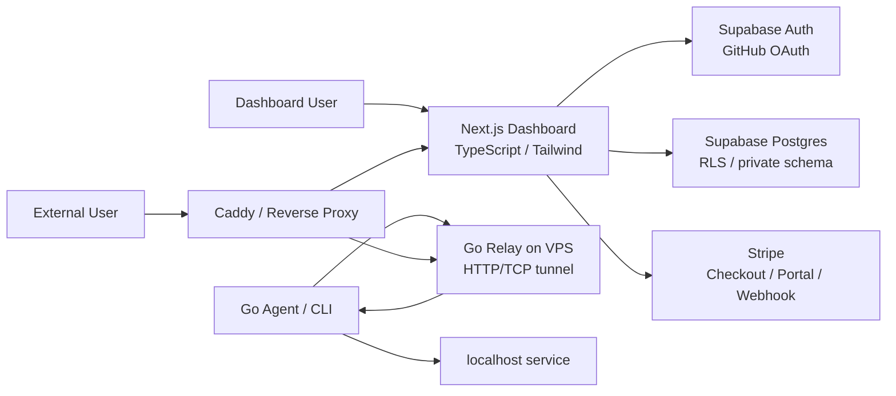
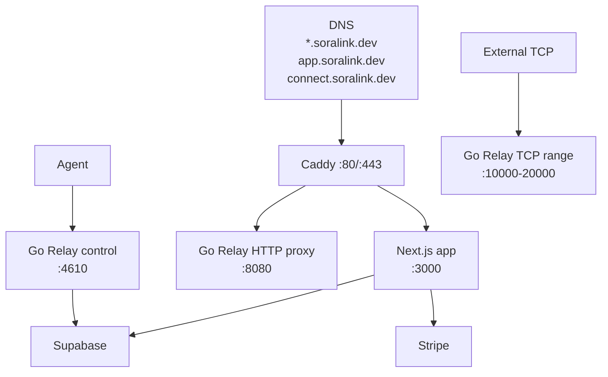

# Soralink 技術スタック

## 1. 選定方針

Soralink は OSS として開発し、Hosted SaaS とセルフホストの両方へ拡張できる構成にする。初期実装では、開発者所有のグローバル IP 付き VPS 1 台を Relay として使い、認証・DB・課金は Supabase / Stripe に任せる。

選定基準:

- ネットワーク中継は Go で堅牢に実装する。
- Dashboard は Supabase Auth / Stripe と相性がよい Next.js を使う。
- DB の認可境界は Supabase RLS で強制する。
- OSS 前提で secret を露出しにくい構成にする。
- MVP では依存を増やしすぎず、必要になったら段階的に足す。



## 2. 採用スタック一覧

| 領域 | 採用 | 用途 |
| --- | --- | --- |
| Relay / Agent | Go | トンネル、TCP/HTTP bridge、CLI |
| CLI framework | Cobra | `soralink http`, `soralink tcp`, `soralink auth` などのサブコマンド |
| 設定ファイル | YAML | `~/.soralink/config.yaml`, `soralink.yml` |
| Dashboard | Next.js App Router | ログイン後の管理画面、BFF/API Route |
| Frontend language | TypeScript | UI と API client の型安全性 |
| UI | React + Tailwind CSS + shadcn/ui | Dashboard UI |
| Icons | lucide-react | ボタン、ナビゲーション、状態表示 |
| Form validation | React Hook Form + Zod | token 作成、endpoint 設定、billing 操作 |
| Auth | Supabase Auth | GitHub OAuth のみ |
| DB | Supabase Postgres | ユーザー、token、endpoint、usage、billing metadata |
| Authorization | Supabase RLS | `user_id = auth.uid()` を基本に行レベルで保護 |
| Billing | Stripe | Checkout、Customer Portal、Webhook |
| Reverse proxy | Caddy | `app`, `api`, wildcard tunnel host の振り分け |
| Deployment | Docker Compose on VPS | Relay、Dashboard、Caddy を単一 VPS で運用 |
| Logs | Go `slog` + JSON logs | Relay / Agent / API の構造化ログ |
| Metrics | Prometheus client | active tunnel、connection、bytes |
| CI | GitHub Actions | test、lint、build、secret scan |
| Release | GoReleaser | CLI / Relay binary の配布 |

## 3. フロントエンド

### 3.1 Dashboard

採用:

- Next.js App Router
- React
- TypeScript
- Tailwind CSS
- shadcn/ui
- lucide-react

理由:

- Supabase Auth の SSR/cookie 運用と相性がよい。
- Stripe Checkout / Customer Portal への導線を作りやすい。
- App Router の Server Components / Route Handlers で、公開 client と secret を扱う server 処理を分離しやすい。
- shadcn/ui はコンポーネントのソースをリポジトリ側で所有できるため、OSS でも調整しやすい。

主要画面:

| 画面 | 内容 |
| --- | --- |
| Login | GitHub OAuth ログイン |
| Dashboard | active tunnel、usage、plan status |
| Tokens | Agent token 作成、名前変更、失効 |
| Endpoints | subdomain、TCP port、access control |
| Billing | 現在プラン、Checkout、Customer Portal |
| Logs | HTTP request log、connection log |
| Settings | profile、danger zone |

### 3.2 データ取得方針

- ログイン状態は Supabase SSR client で cookie session として扱う。
- Dashboard の通常データは Server Components または Route Handlers 経由で取得する。
- secret key / service role key が必要な処理は client component へ置かない。
- interactive な UI だけ client component にする。
- グローバル状態管理ライブラリは MVP では入れない。必要になったら Zustand を検討する。

### 3.3 UI 方針

- SaaS 管理画面として、密度高めで静かな UI にする。
- 大きな marketing hero ではなく、ログイン後は dashboard を first screen にする。
- テーブル、タブ、セグメント、トグル、メニュー、ダイアログを中心に構成する。
- アイコンは lucide-react を優先する。
- request log や tunnel 一覧は scan しやすい表示にする。

## 4. Go Relay / Agent

### 4.1 Go を使う範囲

| コンポーネント | 役割 |
| --- | --- |
| `soralink` CLI | `auth`, `http`, `tcp`, `start`, `status` |
| Agent | Relay へ接続し、ローカル service へ bridge |
| Relay | HTTP/TCP endpoint を受け、Agent へ転送 |
| Protocol package | frame、message、heartbeat、error |
| Metrics package | Prometheus metrics |

### 4.2 Go の主要ライブラリ

| 用途 | 採用候補 | 方針 |
| --- | --- | --- |
| CLI | `spf13/cobra` | サブコマンドが多くなるため採用 |
| Config | `gopkg.in/yaml.v3` | YAML を明示的に parse。Viper は MVP では使わない |
| Logging | standard `log/slog` | JSON log に対応 |
| HTTP/TCP | standard `net`, `net/http` | 中核は標準ライブラリ |
| TLS | standard `crypto/tls` | Agent/Relay 通信の暗号化 |
| Metrics | `prometheus/client_golang` | Phase 6 以降 |
| Multiplex | custom frame first, yamux later | MVP は独自 frame、production で再検討 |

### 4.3 Relay の責務

- Agent token を検証する。
- HTTP Host / TCP port から tunnel を解決する。
- 外部接続と Agent stream を bridge する。
- 接続ログ、転送量、active connection を記録する。
- Supabase / Control Plane と連携して user、plan、quota を取得する。

### 4.4 Agent の責務

- `soralink auth <TOKEN>` で token を保存する。
- `soralink http 3000` / `soralink tcp 22` で tunnel を作成する。
- Relay 切断時に reconnect する。
- ローカルサービスへ接続し、Relay との間で双方向 bridge する。
- token や config をログに出さない。

## 5. Supabase

### 5.1 使用機能

| 機能 | 用途 |
| --- | --- |
| Supabase Auth | GitHub OAuth ログイン |
| Supabase Postgres | アプリ DB |
| Row Level Security | ユーザーごとのデータ分離 |
| SQL migrations | schema / policy 管理 |
| generated types | Dashboard の TypeScript 型 |

### 5.2 RLS 方針

- public schema のアプリ用テーブルは RLS を有効化する。
- 基本 policy は `user_id = auth.uid()`。
- token hash などの秘匿列は RLS だけで守らない。
- 秘匿列は `private` schema、view、RPC、backend API のいずれかで client から隠す。
- RLS policy は migration として repository 管理する。

### 5.3 Supabase key の扱い

| Key | 置き場所 | 方針 |
| --- | --- | --- |
| publishable key | Dashboard frontend | 公開可。RLS が効く前提 |
| anon key | legacy 用 | 新規では publishable key を優先 |
| secret key / service role key | VPS / server env | 公開禁止。RLS を迂回できるため最小範囲で使う |
| user JWT | Browser cookie / API Authorization | API 側で検証する |

## 6. Stripe

採用:

- Stripe Checkout
- Stripe Customer Portal
- Stripe Webhooks

方針:

- Soralink はカード情報を保持しない。
- plan 変更は Checkout / Portal に任せる。
- `checkout.session.completed`, `customer.subscription.updated`, `customer.subscription.deleted` などの webhook で Supabase の billing metadata を同期する。
- Webhook は raw body と `Stripe-Signature` で署名検証してから処理する。

## 7. VPS / インフラ

### 7.1 初期構成

単一 VPS に次を配置する。



### 7.2 VPS 内のプロセス

| プロセス | 起動方式 | 備考 |
| --- | --- | --- |
| Caddy | Docker Compose | TLS 終端、host routing |
| Next.js Dashboard | Docker Compose | `app.soralink.dev` |
| Go Relay | Docker Compose or systemd | tunnel 中継 |
| Node build | CI で build | VPS 上で直接 build しない方針 |

### 7.3 ネットワーク

| Port | 公開 | 用途 |
| --- | --- | --- |
| 80 | yes | HTTP redirect / ACME |
| 443 | yes | Dashboard / HTTP tunnel |
| 4610 | yes | Agent control TLS |
| 10000-20000 | yes | TCP tunnel range |
| 22 | restricted | SSH。管理 IP のみ許可推奨 |

## 8. リポジトリ構成

```text
soralink/
  apps/
    web/                  # Next.js Dashboard
  cmd/
    soralink/             # Go CLI entrypoint
    soralink-relay/       # Go Relay entrypoint
  internal/
    agent/
    relay/
    protocol/
    controlplane/
  supabase/
    migrations/
    seed.sql
  deploy/
    caddy/
    docker-compose.yml
    systemd/
  docs/
    requirements.md
    technical-spec.md
    tech-stack.md
    roadmap.md
```

## 9. 環境変数

### 9.1 Dashboard public env

```env
NEXT_PUBLIC_SUPABASE_URL=https://example.supabase.co
NEXT_PUBLIC_SUPABASE_PUBLISHABLE_KEY=sb_publishable_xxx
NEXT_PUBLIC_STRIPE_PUBLISHABLE_KEY=pk_live_xxx
```

### 9.2 Server secret env

```env
SUPABASE_URL=https://example.supabase.co
SUPABASE_SECRET_KEY=sb_secret_xxx
STRIPE_SECRET_KEY=sk_live_xxx
STRIPE_WEBHOOK_SECRET=whsec_xxx
SORALINK_RELAY_INTERNAL_SECRET=generated-random-secret
```

ルール:

- secret env は `.env.example` に実値を書かない。
- production secret は GitHub、VPS、Supabase、Stripe の管理画面で管理する。
- secret を URL query、ログ、エラーメッセージに出さない。

## 10. テスト / 品質管理

### 10.1 Go

- `go test ./...`
- `go test -race ./...`
- `go vet ./...`
- `govulncheck ./...`
- `golangci-lint` は Phase 2 以降で導入

### 10.2 Web

- TypeScript typecheck
- ESLint
- Prettier
- Vitest + Testing Library
- Playwright E2E

### 10.3 DB / RLS

- Supabase migration のレビュー
- RLS policy のテスト SQL
- 別ユーザーの行が読めないことを integration test に含める
- `agent_tokens.secret_hash` が client API response に出ないことをテストする

### 10.4 Security

- Gitleaks で secret scan
- Dependabot で依存更新
- CodeQL で静的解析
- Trivy で container scan
- Stripe Webhook 署名検証テスト
- Supabase secret key が frontend bundle に含まれないことを CI で検査する

## 11. 後回しにする技術

| 技術 | 理由 |
| --- | --- |
| UDP tunnel | 優先度低め。HTTP/TCP 安定後 |
| Kubernetes | VPS 1 台の MVP には重い |
| Redis | MVP ではメモリ + Supabase で開始。複数 Relay 化時に検討 |
| gRPC | 外部公開 API と Dashboard には REST/Route Handler で十分 |
| 独自 OAuth | Supabase GitHub OAuth で開始 |
| 独自課金実装 | Stripe に任せる |

## 12. 参考公式ドキュメント

- Next.js App Router: https://nextjs.org/docs/app
- Next.js TypeScript: https://nextjs.org/docs/app/api-reference/config/typescript
- Supabase SSR Auth: https://supabase.com/docs/guides/auth/server-side
- Supabase GitHub OAuth: https://supabase.com/docs/guides/auth/social-login/auth-github
- Supabase RLS: https://supabase.com/docs/guides/database/postgres/row-level-security
- Supabase API Keys: https://supabase.com/docs/guides/api/api-keys
- Stripe Checkout: https://docs.stripe.com/payments/checkout
- Stripe Subscriptions: https://docs.stripe.com/payments/subscriptions
- Stripe Webhook Signatures: https://docs.stripe.com/webhooks/signatures
- Tailwind CSS: https://tailwindcss.com/docs/installation/tailwind-cli
- shadcn/ui: https://ui.shadcn.com/docs/components
