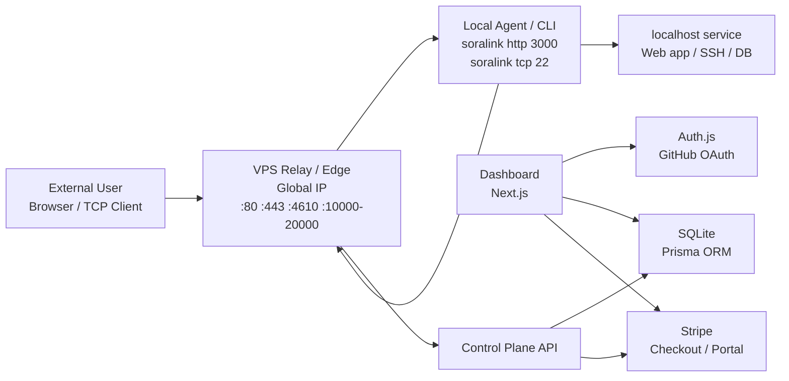
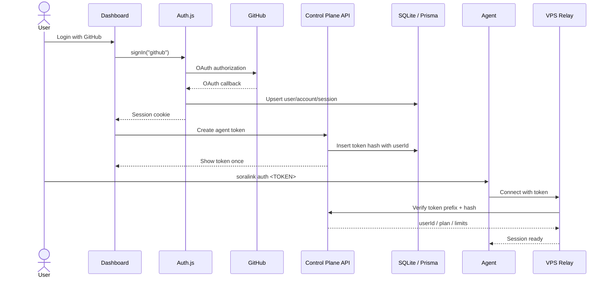
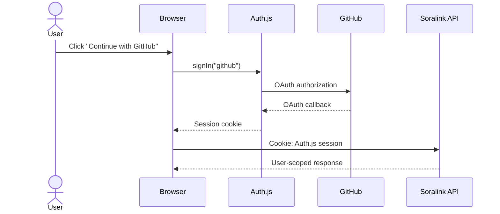

# Soralink 技術仕様

## 1. 技術選定

採用スタックの詳細は [技術スタック](./tech-stack.md) を正とする。この章ではアーキテクチャ理解に必要な要点だけを示す。

| 領域 | 採用候補 | 方針 |
| --- | --- | --- |
| 言語 | Go | ネットワーク処理、並行処理、single binary 配布に向いているため採用 |
| CLI | Cobra | `auth`, `http`, `tcp`, `start`, `status` などのサブコマンドを扱う |
| Dashboard | Next.js App Router + TypeScript | Auth.js / Prisma / Stripe と連携する Web 管理画面 |
| UI | Tailwind CSS + shadcn/ui + lucide-react | OSS で調整しやすいコンポーネント構成 |
| Relay | Go `net`, `net/http`, `crypto/tls` | HTTP/TCP の中継を標準ライブラリ中心で実装 |
| 多重化 | yamux または独自 frame | MVP は実装しやすさ優先。production は yamux などを検討 |
| DB | SQLite | 初期 VPS 1 台で扱いやすいファイル DB として使用 |
| ORM | Prisma | schema、migration、型安全な DB access |
| 認証 | Auth.js | GitHub OAuth のみ対応。独自 password auth は実装しない |
| 課金 | Stripe | Checkout、Customer Portal、Webhook で subscription を管理 |
| 証明書 | autocert / lego | ワイルドカードや DNS-01 が必要になったら lego |
| メトリクス | Prometheus | Phase 2 以降 |
| ホスティング | グローバル IP 付き VPS 1 台 | 初期 Relay / Edge / Dashboard を集約 |
| デプロイ | Docker Compose + Caddy | 単一 VPS 上で Dashboard / Relay / reverse proxy を運用 |

## 2. 全体アーキテクチャ



Hosted SaaS では Relay / Control Plane / Dashboard を分ける。初期 MVP では Relay、Dashboard、SQLite DB を開発者所有の VPS 1 台で動かし、課金は Stripe に任せる。



## 3. コンポーネント

### 3.1 Agent / CLI

責務:

- token をローカルに保存する。
- Relay に接続し、認証済み session を作る。
- `http`, `tcp` などの tunnel 作成要求を送る。
- Relay から来た外部 connection をローカル service に bridge する。
- 切断時に自動再接続する。

想定バイナリ:

```bash
soralink auth <TOKEN>
soralink http 3000
soralink tcp 22
soralink start --config soralink.yml
soralink status
```

### 3.2 Relay / Edge

責務:

- Agent 接続を受け付ける。
- Agent token を Control Plane API 経由で検証する。
- tunnel endpoint を割り当てる。
- HTTP Host / TCP port から tunnel を解決する。
- 外部 connection と Agent stream を bridge する。
- 転送量、接続数、ログ、メトリクスを記録する。

### 3.3 Control Plane API

責務:

- Auth.js session を検証し、ログイン済みユーザーとして API を処理する。
- Agent token 発行、失効。
- domain / endpoint / quota 管理。
- active tunnel 表示。
- dashboard へ JSON API を提供する。
- Stripe Checkout session 作成、Customer Portal session 作成、Webhook 受信。
- Relay からの内部 API request を `SORALINK_RELAY_INTERNAL_SECRET` で認証する。

ユーザー登録、ログイン、OAuth callback は Auth.js が担当する。Control Plane API は独自に password を保持しない。

### 3.4 Dashboard

画面構成、routes、状態設計、UI コンポーネントは [フロントエンド画面仕様](./frontend-spec.md) を正とする。

責務:

- Auth.js の GitHub OAuth でログインする。
- token 発行画面。
- active tunnel 一覧。
- usage 表示。
- domain 設定。
- request log / inspection 表示。
- Stripe Customer Portal への導線を提供する。

### 3.5 Auth.js / Prisma / SQLite

責務:

- GitHub OAuth によるユーザー認証。
- Auth.js Prisma Adapter による User / Account / Session の永続化。
- Soralink 独自テーブルの管理。
- Prisma query の `userId` 条件によりユーザーごとのデータ分離を強制する。

### 3.6 Stripe

責務:

- Checkout による subscription 作成。
- Customer Portal による支払い方法、請求履歴、解約管理。
- Webhook による subscription 状態の同期。
- plan / quota / entitlement の判定。

初期 plan:

| Plan | 月額 | entitlement |
| --- | ---: | --- |
| Free | 0円 | 1 active tunnel、5GB/月、Hosted TCP は invite / disabled |
| Pro | 1,200円 | 5 active tunnel、100GB/月、予約 subdomain 3、固定 TCP port 2 |
| Team | 4,800円 | 5 seats、20 active tunnel、1TB/月、custom domain 10 |
| Enterprise | 個別見積 | dedicated Relay、SLA、個別 quota |

MVP では Stripe の usage-based billing は使わず、Soralink 側の利用量集計で quota を制御する。Stripe には subscription status と price id の同期だけを求める。

## 4. ネットワーク設計

### 4.1 ポート

| ポート | 用途 | 備考 |
| --- | --- | --- |
| 80 | HTTP endpoint | HTTPS redirect または HTTP tunnel |
| 443 | HTTPS endpoint | TLS 終端 |
| 4610 | Agent control | MVP の制御接続。Hosted では `connect.soralink.dev:443` も検討 |
| 10000-20000 | TCP endpoint | MVP の公開 TCP port range |
| 4611 | Admin API | private network / localhost 推奨 |

初期環境では、これらを開発者所有のグローバル IP 付き VPS 1 台に集約する。VPS firewall では必要な port のみ開放し、SSH は鍵認証のみ、root login 無効、systemd または Docker で Relay を常駐させる。

### 4.2 DNS

Hosted SaaS の例:

```text
*.soralink.dev        A/AAAA -> Relay public IP
connect.soralink.dev  A/AAAA -> Relay public IP
api.soralink.dev      A/AAAA -> Control Plane
app.soralink.dev      A/AAAA -> Dashboard
```

HTTP tunnel は wildcard DNS を使って `https://<name>.soralink.dev` へ集約する。

## 5. Tunnel Protocol v1

### 5.1 方針

MVP では次のどちらかを選ぶ。

#### 案 A: 独自 frame + data connection

- 実装が理解しやすい。
- control connection と data connection を分ける。
- 外部接続が来るたび Relay が Agent に connection ID を通知し、Agent が別 TCP 接続で Relay へ戻る。
- 初期学習・小規模 MVP に向く。

#### 案 B: TLS + multiplexed stream

- 1 本の Agent session 上に複数 stream を作る。
- Relay が新規 stream を開き、Agent がローカル service へ bridge する。
- connection ごとに新しい TCP 接続を張らないため効率がよい。
- production に向く。

推奨は、MVP 初期は案 A で最短実装し、HTTP/HTTPS と同時接続が増える段階で案 B へ移行すること。

### 5.2 Control message

JSON message を frame payload として送る。

```json
{
  "type": "hello",
  "agent_version": "0.1.0",
  "token": "slk_xxx",
  "os": "windows",
  "arch": "amd64"
}
```

主要 message:

| Type | Direction | 説明 |
| --- | --- | --- |
| `hello` | Agent -> Relay | token、version、capability を送る |
| `hello_ok` | Relay -> Agent | session_id、利用可能 feature を返す |
| `create_tunnel` | Agent -> Relay | protocol、local addr、希望 subdomain/port を送る |
| `tunnel_ready` | Relay -> Agent | public URL/address を返す |
| `open_connection` | Relay -> Agent | 外部 connection を Agent に通知する |
| `connection_ready` | Agent -> Relay | data connection 準備完了 |
| `ping` | Both | heartbeat |
| `pong` | Both | heartbeat 応答 |
| `close_tunnel` | Both | tunnel 終了 |
| `error` | Both | エラー通知 |

### 5.3 Frame format

独自 frame を使う場合:

```text
+----------+----------+------------------+
| Type 1B  | Len 4B   | Payload JSON     |
+----------+----------+------------------+
```

- Length は Big Endian。
- Max payload は 1 MiB。
- Data stream 本体は frame 化せず `io.Copy` で直接流す。

## 6. HTTP Tunnel

### 6.1 起動例

```bash
soralink http 3000
```

Agent は次を Relay に送る。

```json
{
  "type": "create_tunnel",
  "protocol": "http",
  "local_addr": "127.0.0.1:3000",
  "requested_subdomain": ""
}
```

Relay はランダム名を割り当てる。

```json
{
  "type": "tunnel_ready",
  "tunnel_id": "tun_abc123",
  "public_url": "https://blue-sky-123.soralink.dev"
}
```

### 6.2 Routing

1. Relay が `https://blue-sky-123.soralink.dev` への request を受ける。
2. Host header から tunnel を引く。
3. Agent へ `open_connection` を送る。
4. Agent が `127.0.0.1:3000` に接続する。
5. Relay と Agent 間の stream とローカル接続を bridge する。
6. response を外部 client に返す。

### 6.3 Header

Relay はローカル service へ次のヘッダーを付与する。

```text
X-Forwarded-For: <client-ip>
X-Forwarded-Host: <original-host>
X-Forwarded-Proto: https
X-Soralink-Tunnel-Id: <tunnel-id>
```

### 6.4 WebSocket

- `Connection: Upgrade` と `Upgrade: websocket` を検出する。
- HTTP 接続を hijack し、生 TCP stream として bridge する。
- ping/pong や長時間接続を切らないよう idle timeout を分ける。

## 7. TCP Tunnel

### 7.1 起動例

```bash
soralink tcp 22
```

Agent は次を Relay に送る。

```json
{
  "type": "create_tunnel",
  "protocol": "tcp",
  "local_addr": "127.0.0.1:22",
  "requested_port": 0
}
```

Relay は空き port を割り当てる。

```json
{
  "type": "tunnel_ready",
  "tunnel_id": "tun_def456",
  "public_url": "tcp://jp-1.soralink.dev:21432",
  "remote_port": 21432
}
```

### 7.2 Connection flow

```text
External TCP client
  -> Relay :21432
  -> Relay resolves port to tunnel
  -> Relay asks Agent to open local connection
  -> Agent dials 127.0.0.1:22
  -> Relay bridges both streams
```

## 8. CLI 仕様

### 8.1 設定ファイル

デフォルト:

```text
~/.soralink/config.yaml
```

例:

```yaml
server: "connect.soralink.dev:4610"
token: "slk_xxx"
region: "jp"
log_level: "info"
```

プロジェクト設定:

```yaml
# soralink.yml
tunnels:
  web:
    proto: http
    addr: 3000
    subdomain: myapp
  ssh:
    proto: tcp
    addr: 22
```

### 8.2 コマンド

| Command | 説明 |
| --- | --- |
| `soralink auth <TOKEN>` | token を保存 |
| `soralink http <PORT>` | HTTP tunnel 作成 |
| `soralink tcp <PORT>` | TCP tunnel 作成 |
| `soralink start --config soralink.yml` | 複数 tunnel 起動 |
| `soralink status` | 現在の session/tunnel 表示 |
| `soralink logout` | 保存 token を削除 |
| `soralink version` | version 表示 |

## 9. Control Plane API 仕様

### 9.1 認証方針

ログインは Auth.js の GitHub OAuth のみを使用する。Soralink の API は、Dashboard から送られる Auth.js session cookie を `auth()` で検証して `userId` を確定する。

Soralink 独自の signup/password login endpoint は持たない。



### 9.2 Token API

| Method | Path | 説明 |
| --- | --- | --- |
| `GET` | `/api/v1/tokens` | token 一覧 |
| `POST` | `/api/v1/tokens` | token 作成 |
| `DELETE` | `/api/v1/tokens/{id}` | token 失効 |

Token 作成レスポンス例:

```json
{
  "id": "tok_123",
  "name": "macbook",
  "token": "slk_live_xxxxxxxxx",
  "created_at": "2026-05-17T00:00:00Z"
}
```

`token` は作成レスポンスで一度だけ返す。

### 9.3 Tunnel API

| Method | Path | 説明 |
| --- | --- | --- |
| `GET` | `/api/v1/tunnels` | active tunnel 一覧 |
| `GET` | `/api/v1/tunnels/{id}` | tunnel 詳細 |
| `DELETE` | `/api/v1/tunnels/{id}` | tunnel 停止 |

### 9.4 Billing API

| Method | Path | 説明 |
| --- | --- | --- |
| `GET` | `/api/v1/billing/plans` | plan 一覧と quota |
| `GET` | `/api/v1/billing/usage` | 現在 period の usage / quota |
| `POST` | `/api/v1/billing/checkout` | Stripe Checkout session 作成 |
| `POST` | `/api/v1/billing/portal` | Stripe Customer Portal session 作成 |
| `POST` | `/api/v1/stripe/webhook` | Stripe Webhook 受信 |

Webhook endpoint は Stripe の署名検証に成功した payload のみ処理する。検証前に JSON parse で body を変形しないよう、raw body を保持する。

Checkout 作成時、server は `plan` から許可済み Stripe price id を引き、client から渡された price id をそのまま使わない。

## 10. データモデル

Auth.js Prisma Adapter の標準モデルを基礎にし、Soralink 独自モデルを追加する。ID は Prisma の `String @id @default(cuid())` を基本とする。

### 10.1 Auth.js models

| Model | 用途 |
| --- | --- |
| `User` | Auth.js user。Soralink の owner |
| `Account` | GitHub OAuth account |
| `Session` | Auth.js database session |
| `VerificationToken` | Auth.js 互換用。GitHub OAuth のみなら利用頻度は低い |

### 10.2 Profile

| Field | Type | 説明 |
| --- | --- | --- |
| id | String | profile id |
| userId | String | `User.id` |
| githubUsername | String? | GitHub username |
| displayName | String? | 表示名 |
| avatarUrl | String? | avatar |
| createdAt | DateTime | 作成日時 |
| updatedAt | DateTime | 更新日時 |

### 10.3 AgentToken

`AgentToken` は secret hash を含むため、Dashboard API は一覧 response で `secretHash` を返さない。

| Field | Type | 説明 |
| --- | --- | --- |
| id | String | token id |
| userId | String | owner |
| name | String | 表示名 |
| prefix | String | token 検索用 prefix |
| secretHash | String | token 検証用 hash |
| lastUsedAt | DateTime? | 最終利用 |
| revokedAt | DateTime? | 失効日時 |
| createdAt | DateTime | 作成日時 |

### 10.4 Endpoint

| Field | Type | 説明 |
| --- | --- | --- |
| id | String | endpoint id |
| userId | String | owner |
| protocol | String | http/tcp |
| hostname | String? | HTTP hostname |
| tcpPort | Int? | TCP port |
| reserved | Boolean | 予約済みか |
| createdAt | DateTime | 作成日時 |

### 10.5 TunnelSession

active state はメモリ中心でよいが、監査や dashboard のため永続化してもよい。

| Field | Type | 説明 |
| --- | --- | --- |
| id | String | session id |
| userId | String | owner |
| agentTokenId | String | token |
| relayId | String | Relay |
| connectedAt | DateTime | 接続日時 |
| disconnectedAt | DateTime? | 切断日時 |

### 10.6 ConnectionLog

| Field | Type | 説明 |
| --- | --- | --- |
| id | String | log id |
| userId | String | owner |
| tunnelId | String | tunnel |
| protocol | String | http/tcp |
| remoteAddr | String | 接続元 |
| method | String? | HTTP method |
| path | String? | HTTP path |
| status | Int? | HTTP status |
| bytesIn | BigInt | inbound bytes |
| bytesOut | BigInt | outbound bytes |
| durationMs | Int | 所要時間 |
| startedAt | DateTime | 開始 |
| endedAt | DateTime | 終了 |

### 10.7 BillingCustomer

| Field | Type | 説明 |
| --- | --- | --- |
| userId | String | owner |
| stripeCustomerId | String | Stripe customer |
| stripeSubscriptionId | String? | subscription |
| stripePriceId | String? | 有効な Stripe price |
| plan | String | free/pro/team など |
| planInterval | String? | month/year |
| status | String | active/trialing/past_due/canceled など |
| currentPeriodEnd | DateTime? | 現在期間終了 |
| graceEndsAt | DateTime? | 支払い失敗時の猶予終了 |
| updatedAt | DateTime | 更新日時 |

## 11. リポジトリ構造

```text
soralink/
  apps/
    web/
      app/
      auth.ts
      prisma.ts
  cmd/
    soralink/
    soralink-relay/
  internal/
    agent/
    relay/
    protocol/
  packages/
    controlplane/
    db/
  prisma/
    schema.prisma
    migrations/
  deploy/
    caddy/
    docker-compose.yml
    systemd/
```

## 12. セキュリティ仕様

Soralink は OSS として開発するため、公開リポジトリに漏れた時点で危険な値をコード、設定例、テストログに含めない。`.env.example` は必ずダミー値だけにする。

### 12.1 Token format

```text
slk_<env>_<prefix>_<secret>
```

- `prefix` で DB 検索する。
- `secret` は hash と constant-time compare で検証する。
- token は作成時しか表示しない。

### 12.2 Agent authentication

MVP:

- TLS 上で token を送る。
- Relay は Control Plane API へ token prefix + secret を渡し、検証結果だけを受け取る。
- Control Plane API は token を hash 検証し、`userId`, plan, limit を返す。

Phase 2:

- nonce + HMAC-SHA256 による challenge response を追加する。
- token 本体を毎回送らない方式へ移行する。

### 12.3 Auth.js / GitHub OAuth keys

| Key | 利用場所 | 取り扱い |
| --- | --- | --- |
| `AUTH_SECRET` | Dashboard server | 環境変数のみ。session 署名/暗号化に使用 |
| `AUTH_GITHUB_ID` | Dashboard server | GitHub OAuth client id |
| `AUTH_GITHUB_SECRET` | Dashboard server | 環境変数のみ。公開禁止 |
| `DATABASE_URL` | Dashboard server / Prisma | SQLite file path。browser に出さない |

### 12.4 Authorization 方針

原則:

- Dashboard API は必ず Auth.js session を検証する。
- user-owned table は必ず `userId = session.user.id` で絞る。
- `secretHash` などの秘匿列は response DTO に含めない。
- Relay/backend だけが書き込む operational data は internal secret で保護した API 経由に限定する。
- Prisma Client を client component に import しない。

### 12.5 SQLite 保護

- SQLite DB、WAL、SHM、backup archive は commit 禁止。
- DB ファイルは VPS の永続 volume に置き、アプリ実行ユーザーだけが読める権限にする。
- backup は暗号化し、復元手順を検証する。

### 12.6 Stripe keys

| Key | 利用場所 | 取り扱い |
| --- | --- | --- |
| Stripe publishable key | Dashboard frontend | 公開可能 |
| Stripe secret key | Control Plane API | 環境変数のみ |
| Stripe webhook signing secret | Webhook endpoint | 環境変数のみ |

Webhook は raw body と `Stripe-Signature` を使って署名検証してから処理する。検証失敗時は subscription 状態を更新しない。

### 12.7 Inspection privacy

- デフォルト OFF。
- `--inspect` または dashboard 設定で明示的に ON。
- `Authorization`, `Cookie`, `Set-Cookie` は標準でマスク。
- body 保存サイズ上限を設定する。

## 13. エラー設計

Agent に返す代表エラー:

| Code | 意味 |
| --- | --- |
| `AUTH_INVALID_TOKEN` | token が不正 |
| `AUTH_REVOKED_TOKEN` | token が失効済み |
| `QUOTA_TUNNEL_LIMIT` | tunnel 数上限 |
| `ENDPOINT_SUBDOMAIN_TAKEN` | subdomain 使用済み |
| `ENDPOINT_PORT_UNAVAILABLE` | TCP port 使用不可 |
| `AGENT_VERSION_UNSUPPORTED` | agent version 非対応 |
| `RELAY_SHUTTING_DOWN` | Relay shutdown 中 |

## 14. ログ仕様

構造化ログ例:

```json
{
  "time": "2026-05-17T00:00:00Z",
  "level": "INFO",
  "msg": "tunnel created",
  "tunnel_id": "tun_abc123",
  "user_id": "usr_123",
  "protocol": "http",
  "public_url": "https://blue-sky-123.soralink.dev"
}
```

## 15. テスト方針

### Unit test

- frame encode/decode
- token hash/verify
- tunnel registry
- port allocator
- hostname/subdomain validation
- config load/validate

### Integration test

- Auth.js GitHub OAuth callback は mock で検証する。
- API が別ユーザーの row を返さないことを検証する。
- Agent -> Relay 認証
- HTTP tunnel round trip
- WebSocket tunnel
- TCP tunnel
- Agent disconnect cleanup
- Relay restart + Agent reconnect

### DB / migration test

- `prisma validate`
- `prisma migrate deploy`
- SQLite backup / restore
- `secretHash` が API response に出ないことを検証する。

## 16. 設定例

### Relay

```yaml
relay:
  id: "jp-1"
  public_base_domain: "soralink.dev"
  control_addr: ":4610"
  http_addr: ":80"
  https_addr: ":443"
  tcp_port_range:
    min: 10000
    max: 20000

control_plane:
  base_url: "https://app.soralink.dev"
  internal_secret: "${SORALINK_RELAY_INTERNAL_SECRET}"

tls:
  mode: "manual"
  cert_file: "/etc/soralink/cert.pem"
  key_file: "/etc/soralink/key.pem"

log:
  level: "info"
  format: "json"
```

### Dashboard / server env

```env
AUTH_SECRET=generated-random-secret
AUTH_GITHUB_ID=github-oauth-client-id
AUTH_GITHUB_SECRET=github-oauth-client-secret
DATABASE_URL=file:/var/lib/soralink/soralink.db
STRIPE_SECRET_KEY=sk_live_xxx
STRIPE_WEBHOOK_SECRET=whsec_xxx
STRIPE_PRICE_PRO_MONTHLY=price_xxx
STRIPE_PRICE_TEAM_MONTHLY=price_xxx
STRIPE_PRICE_PRO_YEARLY=price_xxx
STRIPE_PRICE_TEAM_YEARLY=price_xxx
SORALINK_RELAY_INTERNAL_SECRET=generated-random-secret
```

frontend には GitHub OAuth secret、Auth.js secret、Stripe secret key、`DATABASE_URL` を置かない。

### Agent project config

```yaml
tunnels:
  web:
    proto: http
    addr: 3000
    subdomain: ""
    inspect: false
  ssh:
    proto: tcp
    addr: 22
    remote_port: 0
```

## 17. OSS セキュリティ運用

- `.env`, `.env.local`, `*.pem`, `*.key`, production config は gitignore する。
- `*.db`, `*.db-wal`, `*.db-shm`, backup archive は gitignore する。
- `.env.example` には dummy value のみ置く。
- GitHub Actions の secret は最小権限にし、PR from fork では secret を使う job を動かさない。
- secret scanning と依存関係スキャンを有効化する。
- Prisma query、token 発行、Stripe Webhook、ログ出力はセキュリティレビュー必須にする。
- Relay は VPS 上で root ではなく専用ユーザーで実行する。
- SSH は鍵認証のみ、root login 無効、必要 port のみ firewall で開放する。

## 18. 参考情報

- Auth.js: https://authjs.dev/
- Auth.js GitHub Provider: https://authjs.dev/getting-started/providers/github
- Auth.js Prisma Adapter: https://authjs.dev/getting-started/adapters/prisma
- Prisma SQLite: https://www.prisma.io/docs/concepts/database-connectors/sqlite
- Prisma Migrate: https://docs.prisma.io/docs/cli/migrate
- Stripe Subscriptions: https://docs.stripe.com/payments/subscriptions
- Stripe Webhook Signatures: https://docs.stripe.com/webhooks/signatures
