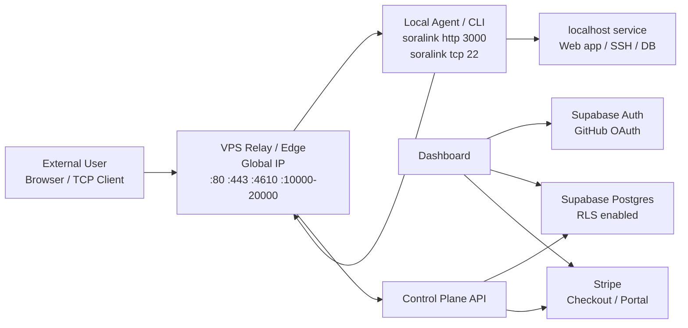
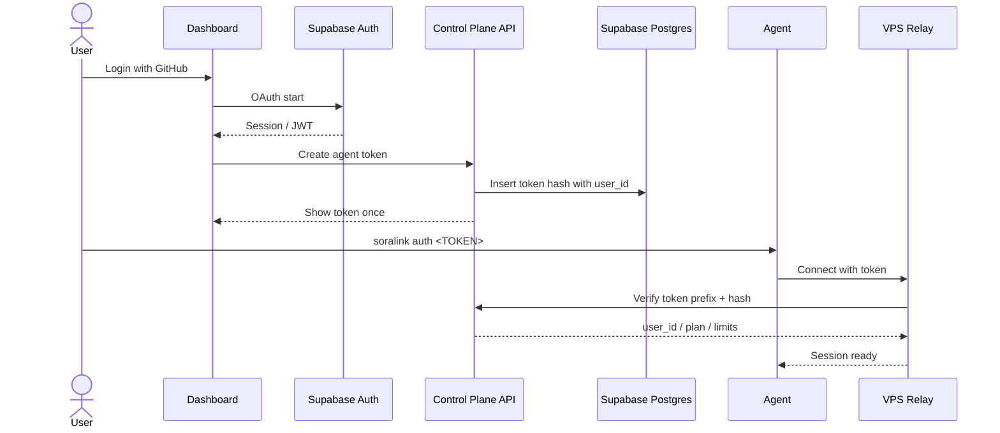
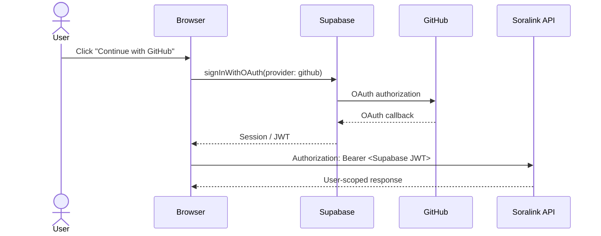

# Soralink 技術仕様

## 1. 技術選定

採用スタックの詳細は [技術スタック](./tech-stack.md) を正とする。この章ではアーキテクチャ理解に必要な要点だけを示す。

| 領域 | 採用候補 | 方針 |
| --- | --- | --- |
| 言語 | Go | ネットワーク処理、並行処理、single binary 配布に向いているため採用 |
| CLI | Cobra | `auth`, `http`, `tcp`, `start`, `status` などのサブコマンドを扱う |
| Dashboard | Next.js App Router + TypeScript | Supabase Auth / Stripe と連携する Web 管理画面 |
| UI | Tailwind CSS + shadcn/ui + lucide-react | OSS で調整しやすいコンポーネント構成 |
| Relay | Go `net`, `net/http`, `crypto/tls` | HTTP/TCP の中継を標準ライブラリ中心で実装 |
| 多重化 | yamux または独自 frame | MVP は実装しやすさ優先。production は yamux などを検討 |
| DB | Supabase Postgres | Hosted/SaaS の主 DB として使用。RLS policy を必須にする |
| 認証 | Supabase Auth | GitHub OAuth のみ対応。独自 password auth は実装しない |
| 課金 | Stripe | Checkout、Customer Portal、Webhook で subscription を管理 |
| 証明書 | autocert / lego | ワイルドカードや DNS-01 が必要になったら lego |
| メトリクス | Prometheus | Phase 2 以降 |
| ホスティング | グローバル IP 付き VPS 1 台 | 初期 Relay / Edge として使用 |
| デプロイ | Docker Compose + Caddy | 単一 VPS 上で Dashboard / Relay / reverse proxy を運用 |

## 2. 全体アーキテクチャ



Hosted SaaS では Relay / Control Plane / Dashboard を分ける。初期 MVP では Relay は開発者所有の VPS 1 台で動かし、認証・DB・課金は Supabase / Stripe に任せる。



## 3. コンポーネント

### 3.1 Agent / CLI

責務:

- token をローカルに保存する。
- Relay に接続し、認証済み session を作る。
- `http`, `tcp` などの tunnel 作成要求を送る。
- Relay から来た外部 connection をローカル service に bridge する。
- 切断時に自動再接続する。

想定バイナリ:

```bash
soralink auth <TOKEN>
soralink http 3000
soralink tcp 22
soralink start --config soralink.yml
soralink status
```

### 3.2 Relay / Edge

責務:

- Agent 接続を受け付ける。
- Agent token を検証する。
- tunnel endpoint を割り当てる。
- HTTP Host / TCP port から tunnel を解決する。
- 外部 connection と Agent stream を bridge する。
- 転送量、接続数、ログ、メトリクスを記録する。

### 3.3 Control Plane API

責務:

- Supabase JWT を検証し、ログイン済みユーザーとして API を処理する。
- Agent token 発行、失効。
- domain / endpoint / quota 管理。
- active tunnel 表示。
- dashboard へ JSON API を提供する。
- Stripe Checkout session 作成、Customer Portal session 作成、Webhook 受信。

ユーザー登録、ログイン、OAuth callback は Supabase Auth が担当する。Control Plane API は独自に password を保持しない。

### 3.4 Dashboard

責務:

- Supabase Auth の GitHub OAuth でログインする。
- token 発行画面。
- active tunnel 一覧。
- usage 表示。
- domain 設定。
- request log / inspection 表示。
- Stripe Customer Portal への導線を提供する。

### 3.5 Supabase

責務:

- GitHub OAuth によるユーザー認証。
- `auth.users` を信頼できる user identity として扱う。
- アプリ用テーブルを Supabase Postgres に保存する。
- RLS policy によりユーザーごとのデータ分離を DB 側で強制する。

### 3.6 Stripe

責務:

- Checkout による subscription 作成。
- Customer Portal による支払い方法、請求履歴、解約管理。
- Webhook による subscription 状態の同期。

## 4. ネットワーク設計

### 4.1 ポート

| ポート | 用途 | 備考 |
| --- | --- | --- |
| 80 | HTTP endpoint | HTTPS redirect または HTTP tunnel |
| 443 | HTTPS endpoint | TLS 終端 |
| 4610 | Agent control | MVP の制御接続。Hosted では `connect.soralink.dev:443` も検討 |
| 10000-20000 | TCP endpoint | MVP の公開 TCP port range |
| 4611 | Admin API | private network / localhost 推奨 |

初期環境では、これらを開発者所有のグローバル IP 付き VPS 1 台に集約する。VPS firewall では必要な port のみ開放し、SSH は鍵認証のみ、root login 無効、systemd または Docker で Relay を常駐させる。

### 4.2 DNS

Hosted SaaS の例:

```text
*.soralink.dev        A/AAAA -> Relay public IP
connect.soralink.dev  A/AAAA -> Relay public IP
api.soralink.dev      A/AAAA -> Control Plane
app.soralink.dev      A/AAAA -> Dashboard
```

HTTP tunnel は wildcard DNS を使って `https://<name>.soralink.dev` へ集約する。

## 5. Tunnel Protocol v1

### 5.1 方針

MVP では次のどちらかを選ぶ。

#### 案 A: 独自 frame + data connection

- 実装が理解しやすい。
- control connection と data connection を分ける。
- 外部接続が来るたび Relay が Agent に connection ID を通知し、Agent が別 TCP 接続で Relay へ戻る。
- 初期学習・小規模 MVP に向く。

#### 案 B: TLS + multiplexed stream

- 1 本の Agent session 上に複数 stream を作る。
- Relay が新規 stream を開き、Agent がローカル service へ bridge する。
- connection ごとに新しい TCP 接続を張らないため効率がよい。
- production に向く。

推奨は、MVP 初期は案 A で最短実装し、HTTP/HTTPS と同時接続が増える段階で案 B へ移行すること。

### 5.2 Control message

JSON message を frame payload として送る。

```json
{
  "type": "hello",
  "agent_version": "0.1.0",
  "token": "slk_xxx",
  "os": "windows",
  "arch": "amd64"
}
```

主要 message:

| Type | Direction | 説明 |
| --- | --- | --- |
| `hello` | Agent -> Relay | token、version、capability を送る |
| `hello_ok` | Relay -> Agent | session_id、利用可能 feature を返す |
| `create_tunnel` | Agent -> Relay | protocol、local addr、希望 subdomain/port を送る |
| `tunnel_ready` | Relay -> Agent | public URL/address を返す |
| `open_connection` | Relay -> Agent | 外部 connection を Agent に通知する |
| `connection_ready` | Agent -> Relay | data connection 準備完了 |
| `ping` | Both | heartbeat |
| `pong` | Both | heartbeat 応答 |
| `close_tunnel` | Both | tunnel 終了 |
| `error` | Both | エラー通知 |

### 5.3 Frame format

独自 frame を使う場合:

```text
+----------+----------+------------------+
| Type 1B  | Len 4B   | Payload JSON     |
+----------+----------+------------------+
```

- Length は Big Endian。
- Max payload は 1 MiB。
- Data stream 本体は frame 化せず `io.Copy` で直接流す。

## 6. HTTP Tunnel

### 6.1 起動例

```bash
soralink http 3000
```

Agent は次を Relay に送る。

```json
{
  "type": "create_tunnel",
  "protocol": "http",
  "local_addr": "127.0.0.1:3000",
  "requested_subdomain": ""
}
```

Relay はランダム名を割り当てる。

```json
{
  "type": "tunnel_ready",
  "tunnel_id": "tun_abc123",
  "public_url": "https://blue-sky-123.soralink.dev"
}
```

### 6.2 Routing

1. Relay が `https://blue-sky-123.soralink.dev` への request を受ける。
2. Host header から tunnel を引く。
3. Agent へ `open_connection` を送る。
4. Agent が `127.0.0.1:3000` に接続する。
5. Relay と Agent 間の stream とローカル接続を bridge する。
6. response を外部 client に返す。

### 6.3 Header

Relay はローカル service へ次のヘッダーを付与する。

```text
X-Forwarded-For: <client-ip>
X-Forwarded-Host: <original-host>
X-Forwarded-Proto: https
X-Soralink-Tunnel-Id: <tunnel-id>
```

### 6.4 WebSocket

- `Connection: Upgrade` と `Upgrade: websocket` を検出する。
- HTTP 接続を hijack し、生 TCP stream として bridge する。
- ping/pong や長時間接続を切らないよう idle timeout を分ける。

## 7. TCP Tunnel

### 7.1 起動例

```bash
soralink tcp 22
```

Agent は次を Relay に送る。

```json
{
  "type": "create_tunnel",
  "protocol": "tcp",
  "local_addr": "127.0.0.1:22",
  "requested_port": 0
}
```

Relay は空き port を割り当てる。

```json
{
  "type": "tunnel_ready",
  "tunnel_id": "tun_def456",
  "public_url": "tcp://jp-1.soralink.dev:21432",
  "remote_port": 21432
}
```

### 7.2 Connection flow

```text
External TCP client
  -> Relay :21432
  -> Relay resolves port to tunnel
  -> Relay asks Agent to open local connection
  -> Agent dials 127.0.0.1:22
  -> Relay bridges both streams
```

## 8. CLI 仕様

### 8.1 設定ファイル

デフォルト:

```text
~/.soralink/config.yaml
```

例:

```yaml
server: "connect.soralink.dev:4610"
token: "slk_xxx"
region: "jp"
log_level: "info"
```

プロジェクト設定:

```yaml
# soralink.yml
tunnels:
  web:
    proto: http
    addr: 3000
    subdomain: myapp
  ssh:
    proto: tcp
    addr: 22
```

### 8.2 コマンド

| Command | 説明 |
| --- | --- |
| `soralink auth <TOKEN>` | token を保存 |
| `soralink http <PORT>` | HTTP tunnel 作成 |
| `soralink tcp <PORT>` | TCP tunnel 作成 |
| `soralink start --config soralink.yml` | 複数 tunnel 起動 |
| `soralink status` | 現在の session/tunnel 表示 |
| `soralink logout` | 保存 token を削除 |
| `soralink version` | version 表示 |

### 8.3 出力例

```text
Soralink 0.1.0
Status: connected
Region: jp

Forwarding:
  https://blue-sky-123.soralink.dev -> http://localhost:3000

Requests:
  GET /api/health 200 12ms
  POST /webhook   204 31ms
```

## 9. Control Plane API 仕様

### 9.1 認証方針

ログインは Supabase Auth の GitHub OAuth のみを使用する。Soralink の API は、Dashboard から送られる Supabase JWT を検証して `user_id` を確定する。

Soralink 独自の signup/password login endpoint は持たない。



### 9.2 Token API

| Method | Path | 説明 |
| --- | --- | --- |
| `GET` | `/api/v1/tokens` | token 一覧 |
| `POST` | `/api/v1/tokens` | token 作成 |
| `DELETE` | `/api/v1/tokens/{id}` | token 失効 |

Token 作成レスポンス例:

```json
{
  "id": "tok_123",
  "name": "macbook",
  "token": "slk_live_xxxxxxxxx",
  "created_at": "2026-05-16T00:00:00Z"
}
```

`token` は作成レスポンスで一度だけ返す。

### 9.3 Tunnel API

| Method | Path | 説明 |
| --- | --- | --- |
| `GET` | `/api/v1/tunnels` | active tunnel 一覧 |
| `GET` | `/api/v1/tunnels/{id}` | tunnel 詳細 |
| `DELETE` | `/api/v1/tunnels/{id}` | tunnel 停止 |

レスポンス例:

```json
{
  "id": "tun_abc123",
  "protocol": "http",
  "public_url": "https://blue-sky-123.soralink.dev",
  "local_addr": "127.0.0.1:3000",
  "agent_id": "agt_123",
  "created_at": "2026-05-16T00:00:00Z",
  "active_connections": 2,
  "bytes_in": 1048576,
  "bytes_out": 2048576
}
```

### 9.4 Billing API

| Method | Path | 説明 |
| --- | --- | --- |
| `POST` | `/api/v1/billing/checkout` | Stripe Checkout session 作成 |
| `POST` | `/api/v1/billing/portal` | Stripe Customer Portal session 作成 |
| `POST` | `/api/v1/stripe/webhook` | Stripe Webhook 受信 |

Webhook endpoint は Stripe の署名検証に成功した payload のみ処理する。検証前に JSON parse で body を変形しないよう、raw body を保持する。

## 10. データモデル

Supabase Auth が `auth.users` を管理する。Soralink のアプリ用テーブルでは `user_id uuid references auth.users(id)` を持たせ、RLS policy の基本条件を `user_id = auth.uid()` にする。

### 10.1 auth.users

Supabase 管理テーブル。Soralink 側で直接 migration 管理しない。

| Column | Type | 説明 |
| --- | --- | --- |
| id | uuid | Supabase user id |
| email | text | GitHub OAuth から取得される email。取得できない場合がある |
| created_at | timestamptz | 作成日時 |

### 10.2 profiles

| Column | Type | 説明 |
| --- | --- | --- |
| user_id | uuid | `auth.users.id` |
| github_username | text nullable | GitHub username |
| display_name | text nullable | 表示名 |
| avatar_url | text nullable | avatar |
| created_at | timestamptz | 作成日時 |
| updated_at | timestamptz | 更新日時 |

RLS:

- `select`: `user_id = auth.uid()`
- `insert`: `user_id = auth.uid()`
- `update`: `user_id = auth.uid()`

### 10.3 agent_tokens

`agent_tokens` は secret hash を含むため、Dashboard frontend からテーブルを直接 select させない。実装では次のどちらかを採用する。

- `private.agent_tokens` のように Data API 非公開の schema に置き、backend API / security definer RPC だけが読む。
- `public.agent_tokens` に置く場合でも `secret_hash` への column privilege を client role に与えず、一覧表示は `agent_token_summaries` view から返す。

| Column | Type | 説明 |
| --- | --- | --- |
| id | uuid | token id |
| user_id | uuid | owner |
| name | text | 表示名 |
| prefix | text | token 検索用 prefix |
| secret_hash | text | token 検証用 hash。client には返さない |
| last_used_at | timestamptz nullable | 最終利用 |
| revoked_at | timestamptz nullable | 失効日時 |
| created_at | timestamptz | 作成日時 |

RLS:

- `select`: Dashboard frontend から直接許可しない。表示用 view/RPC は `user_id = auth.uid()` で絞り、`secret_hash` を返さない。
- `insert`: Dashboard から直接 insert させず、backend API または RPC で token を生成する。
- `update`: `user_id = auth.uid()` かつ更新可能列を `name`, `revoked_at` に限定する。
- `delete`: 原則物理削除しない。失効は `revoked_at` 更新で表す。

### 10.4 endpoints

| Column | Type | 説明 |
| --- | --- | --- |
| id | uuid | endpoint id |
| user_id | uuid | owner |
| protocol | text | http/tcp |
| hostname | text nullable | HTTP hostname |
| tcp_port | int nullable | TCP port |
| reserved | bool | 予約済みか |
| created_at | timestamptz | 作成日時 |

RLS:

- `select`: `user_id = auth.uid()`
- `insert/update/delete`: `user_id = auth.uid()` かつ quota check は backend 側で実施する。

### 10.5 tunnel_sessions

active state はメモリ中心でよいが、監査や dashboard のため永続化してもよい。

| Column | Type | 説明 |
| --- | --- | --- |
| id | uuid | session id |
| user_id | uuid | owner |
| agent_token_id | uuid | token |
| relay_id | text | Relay |
| connected_at | timestamptz | 接続日時 |
| disconnected_at | timestamptz nullable | 切断日時 |

RLS:

- `select`: `user_id = auth.uid()`
- `insert/update`: Relay/backend のみ。client から直接書かせない。

### 10.6 connection_logs

| Column | Type | 説明 |
| --- | --- | --- |
| id | uuid | log id |
| user_id | uuid | owner |
| tunnel_id | uuid | tunnel |
| protocol | text | http/tcp |
| remote_addr | text | 接続元 |
| method | text nullable | HTTP method |
| path | text nullable | HTTP path |
| status | int nullable | HTTP status |
| bytes_in | int64 | inbound bytes |
| bytes_out | int64 | outbound bytes |
| duration_ms | int | 所要時間 |
| started_at | timestamptz | 開始 |
| ended_at | timestamptz | 終了 |

RLS:

- `select`: `user_id = auth.uid()`
- `insert`: Relay/backend のみ。client から直接書かせない。

### 10.7 billing_customers

| Column | Type | 説明 |
| --- | --- | --- |
| user_id | uuid | owner |
| stripe_customer_id | text | Stripe customer |
| stripe_subscription_id | text nullable | subscription |
| plan | text | free/pro/team など |
| status | text | active/trialing/past_due/canceled など |
| current_period_end | timestamptz nullable | 現在期間終了 |
| updated_at | timestamptz | 更新日時 |

RLS:

- `select`: `user_id = auth.uid()`
- `insert/update`: Stripe Webhook を処理する backend のみ。

## 11. Relay 内部構造

Go package 例:

```text
cmd/
  soralink/
    main.go
internal/
  agent/
  relay/
    server.go
    tunnel.go
    http_proxy.go
    tcp_proxy.go
    bridge.go
  protocol/
    frame.go
    message.go
  controlplane/
    api.go
    auth.go
    tokens.go
    billing.go
  store/
    supabase.go
    rls.sql
```

主要 interface:

```go
type Tunnel struct {
    ID        string
    UserID    string
    Protocol  string
    PublicURL string
    LocalAddr string
    SessionID string
}

type Session interface {
    ID() string
    OpenStream(ctx context.Context, tunnelID string) (net.Conn, error)
    Close() error
}

type TunnelRegistry interface {
    Register(t *Tunnel) error
    FindByHost(host string) (*Tunnel, bool)
    FindByTCPPort(port int) (*Tunnel, bool)
    Remove(tunnelID string) error
}
```

## 12. セキュリティ仕様

Soralink は OSS として開発するため、公開リポジトリに漏れた時点で危険な値をコード、設定例、テストログに含めない。`.env.example` は必ずダミー値だけにする。

### 12.1 Token format

```text
slk_<env>_<prefix>_<secret>
```

例:

```text
slk_live_abcd1234_xxxxxxxxxxxxxxxxxxxxxxxxxxxxxxxx
```

- `prefix` で DB 検索する。
- `secret` は hash と constant-time compare で検証する。
- token は作成時しか表示しない。

### 12.2 Agent authentication

MVP:

- TLS 上で token を送る。
- Relay は hash 検証する。

Phase 2:

- nonce + HMAC-SHA256 による challenge response を追加する。
- token 本体を毎回送らない方式へ移行する。

### 12.3 Supabase keys

| Key | 利用場所 | 取り扱い |
| --- | --- | --- |
| Supabase publishable key | Dashboard frontend | 公開 client に置いてよい。ただし RLS 前提 |
| Supabase secret key / service role key | Control Plane API / Relay backend | 環境変数のみ。公開 client、CLI、リポジトリ、ログに出さない |
| Supabase JWT | Dashboard -> API | `Authorization: Bearer` で送信し、API 側で検証 |

secret key / service role key は RLS を迂回できる権限を持つため、使用箇所を backend の最小範囲に限定する。

### 12.4 RLS policy 方針

原則:

- アプリ用テーブルは RLS を有効化する。
- ユーザー所有データは `user_id = auth.uid()` を基本条件にする。
- secret を含む列は RLS だけに頼らず、private schema、column privilege、view、RPC、backend API のいずれかで client から直接 select できないようにする。
- Relay/backend だけが書き込む operational data は、client から insert/update/delete できない policy にする。
- migration に RLS policy を含め、PR レビュー対象にする。

policy 例:

```sql
alter table public.endpoints enable row level security;

create policy "users can read own endpoints"
on public.endpoints
for select
to authenticated
using (user_id = auth.uid());

create policy "users can create own endpoints"
on public.endpoints
for insert
to authenticated
with check (user_id = auth.uid());
```

token 一覧用 view 例:

```sql
create view public.agent_token_summaries as
select
  id,
  user_id,
  name,
  prefix,
  last_used_at,
  revoked_at,
  created_at
from private.agent_tokens;

alter view public.agent_token_summaries set (security_invoker = true);
```

### 12.5 Stripe keys

| Key | 利用場所 | 取り扱い |
| --- | --- | --- |
| Stripe publishable key | Dashboard frontend | 公開可能 |
| Stripe secret key | Control Plane API | 環境変数のみ |
| Stripe webhook signing secret | Webhook endpoint | 環境変数のみ |

Webhook は raw body と `Stripe-Signature` を使って署名検証してから処理する。検証失敗時は subscription 状態を更新しない。

### 12.6 Access control

Endpoint ごとに以下を設定できるようにする。

- IP allowlist / denylist
- Basic Auth
- Bearer token
- 将来の OAuth/OIDC login
- rate limit
- max concurrent connections

### 12.7 Inspection privacy

- デフォルト OFF。
- `--inspect` または dashboard 設定で明示的に ON。
- `Authorization`, `Cookie`, `Set-Cookie` は標準でマスク。
- body 保存サイズ上限を設定する。

## 13. エラー設計

Agent に返す代表エラー:

| Code | 意味 |
| --- | --- |
| `AUTH_INVALID_TOKEN` | token が不正 |
| `AUTH_REVOKED_TOKEN` | token が失効済み |
| `QUOTA_TUNNEL_LIMIT` | tunnel 数上限 |
| `ENDPOINT_SUBDOMAIN_TAKEN` | subdomain 使用済み |
| `ENDPOINT_PORT_UNAVAILABLE` | TCP port 使用不可 |
| `AGENT_VERSION_UNSUPPORTED` | agent version 非対応 |
| `RELAY_SHUTTING_DOWN` | Relay shutdown 中 |

## 14. ログ仕様

構造化ログ例:

```json
{
  "time": "2026-05-16T00:00:00Z",
  "level": "INFO",
  "msg": "tunnel created",
  "tunnel_id": "tun_abc123",
  "user_id": "usr_123",
  "protocol": "http",
  "public_url": "https://blue-sky-123.soralink.dev"
}
```

connection 完了ログ:

```json
{
  "time": "2026-05-16T00:00:12Z",
  "level": "INFO",
  "msg": "connection closed",
  "tunnel_id": "tun_abc123",
  "protocol": "http",
  "remote_addr": "203.0.113.10",
  "method": "GET",
  "path": "/api/health",
  "status": 200,
  "bytes_in": 512,
  "bytes_out": 1024,
  "duration_ms": 12
}
```

## 15. テスト方針

### Unit test

- frame encode/decode
- token hash/verify
- tunnel registry
- port allocator
- hostname/subdomain validation
- config load/validate

### Integration test

- Agent -> Relay 認証
- HTTP tunnel round trip
- WebSocket tunnel
- TCP tunnel
- Agent disconnect cleanup
- Relay restart + Agent reconnect

### Load test

- concurrent tunnel 作成
- 1 tunnel あたりの concurrent connection
- 大容量 streaming
- long-lived WebSocket

## 16. 設定例

### Relay

```yaml
relay:
  id: "jp-1"
  public_base_domain: "soralink.dev"
  control_addr: ":4610"
  http_addr: ":80"
  https_addr: ":443"
  tcp_port_range:
    min: 10000
    max: 20000

storage:
  driver: "supabase"
  project_url: "${SUPABASE_URL}"
  secret_key: "${SUPABASE_SECRET_KEY}"

tls:
  mode: "manual"
  cert_file: "/etc/soralink/cert.pem"
  key_file: "/etc/soralink/key.pem"

stripe:
  secret_key: "${STRIPE_SECRET_KEY}"
  webhook_secret: "${STRIPE_WEBHOOK_SECRET}"

log:
  level: "info"
  format: "json"
```

### Dashboard / frontend

```env
NEXT_PUBLIC_SUPABASE_URL=https://example.supabase.co
NEXT_PUBLIC_SUPABASE_PUBLISHABLE_KEY=sb_publishable_xxx
NEXT_PUBLIC_STRIPE_PUBLISHABLE_KEY=pk_live_xxx
```

frontend には Supabase secret key、service role key、Stripe secret key を置かない。

### Agent project config

```yaml
tunnels:
  web:
    proto: http
    addr: 3000
    subdomain: ""
    inspect: false
  ssh:
    proto: tcp
    addr: 22
    remote_port: 0
```

## 17. OSS セキュリティ運用

- `.env`, `.env.local`, `*.pem`, `*.key`, production config は gitignore する。
- `.env.example` には dummy value のみ置く。
- GitHub Actions の secret は最小権限にし、PR from fork では secret を使う job を動かさない。
- secret scanning と依存関係スキャンを有効化する。
- RLS policy、token 発行、Stripe Webhook、ログ出力はセキュリティレビュー必須にする。
- Relay は VPS 上で root ではなく専用ユーザーで実行する。
- SSH は鍵認証のみ、root login 無効、必要 port のみ firewall で開放する。

## 18. 参考情報

- Supabase Auth: https://supabase.com/docs/guides/auth
- Supabase GitHub OAuth: https://supabase.com/docs/guides/auth/social-login/auth-github
- Supabase Row Level Security: https://supabase.com/docs/guides/database/postgres/row-level-security
- Supabase API Keys: https://supabase.com/docs/guides/api/api-keys
- Stripe Subscriptions: https://docs.stripe.com/payments/subscriptions
- Stripe Webhook Signatures: https://docs.stripe.com/webhooks/signatures
